# Algorithm of Compression reimplementation 
# AKA project Elphaba

## 25 Nov

I have read through the students' C code, think I now have a general understanding of how it works.

Now I will try to implement the algorithm in python.

This project will be named as Project Elphaba, cus this is where the magic is.


After observing the C code again, I think the student did the data generation using a certain level of density for a certain crystal and then randomly generate a position to be embedded.

And there are only 3 types of particles: small (sphere), medium (rectangular AR5 ROT) and large (Rosette)

It first calculates how many particles of a certain type there will be, and then generate a particle in this cube. As for the diameter of this particle, it will be randomly generated by a gamma function which has a fixed average and variance.


## 26 Nov

There are already generated data files on the microsoft teams folders.

UoM-G-MLU:

Documents > Next-Gen Optical Array Probe > Simulation Data > data files

There is a document describing what these data files are, they are all .h5 files.

The impact of the threshold, and 2-bit/3-bit and how that would affect our compression.

Important greyscale values for thresholds

30-40% 50% 65-67%


1 is no blockage bright, 0 is all blocked no value.


Ok, so I have just viewed the images in the sharepoint that was generated by Jonny, and they are 3D image arrays.

It basically generates a whole sets of 2D images with different Z distance to the focal point, so the image looks from clear to blurry.

Here I attach an exemplary gif to present the images


I am not sure if these images are enough for me to test the pressure the FIFO has to face.

But can be a good starting point to implement the compression algorithm.


## 27 Nov

I shall start drafting up the compression algorithm and write them into a class.

I shall start with the most simple one, 2 byte run length encoding (2BRLE).

Finished the implementation of the basic run-length encoding class implementation.

Now doing a simple testing...


Just realised that the images loaded into the class is too big, it is 500 by 500, which will exceed the largest capacity for this class for sure.

Now switching to a smaller image...


Then the tool reports that it only supports integers, and then I realised I have not implement the quantiser yet.

Starting to implement the quantisation class...


<h2 id="image-quantisation-and-presentation-28-nov">28 Nov</h2>

Quantisation class should be also very simple, this shall just follow the given thresholds.

However, I noticed that the generated pixel values needs to be reversed first.

Cus when there is nothing, the value for the pixel is 1.000, I want it to be zero.

This will be implemented as well, but not sure if this is worth mentioning during the meeting.

The quantiser is now implemented with a 2-bit and 3-bit quantiser, where I used a 2-bit quantiser to quantise the image before getting it compressed.

The images below is the uncompressed floating point image of this sphere:


After quantisation, the image is shown below with 4 different integer values, most of the pixel is smeared after quantisation


When it comes to size, after compression, the file only takes 240 bytes without the row-ender (2 bytes of 0 to mark the end of the row).

This would give us a compression rate ($R$) as follow:

$$
R = 1 - \frac{240}{100\times100} = 97.6\%
$$


## 2 Dec

Now that I have already implemented the simple 2Byte run-length encoding, other variations of 2Byte run length encoding should also be implemented.


What comes next should be the 2-byte run length encoding with row difference and special cases considered all zero row and row marker values encoded.


Ok I have just implemented both 

RLE_RD_2B and RLE_AZ_W_RM_2B

and did the same test on the same image, presented in the log in [28 Nov](#image-quantisation-and-presentation-28-nov).

I have got the following results for this image:


## 3 Dec

After having the meeting today I wrote another class to do quantisation on the image into 3 bits, where steve was talking about the "capped" pixel intensity needs to be considered.

So this new class of quantiser **Quantiser_3B_uniform_dist_INV**, will consider the capped pixel intensity and quantise the rest region into 8 different levels with 7 thresholds.

The following image shows how this would affect the quantised image with 3 bits


I can also consider adding a method for the encoder to return the compression ratio.


## 4 Dec

Added the method to make the encoder report the compression ratio, this has been fairly easy to implement.

And here reports the compression ratio from the script:
The following compression belongs to the 2-bit images:


The following compression reports the 3-bit images:


What comes next should be the plot of the compression ratio against the focal position for different droplets.


## 5 Dec

Continued from previous work, I think I should do the experiment now and plot out the comparison figures to see how the compression ratio will be affected by the focal point displacement.


And also because we are dealing with images with more than 256 pixels, I think I should probably add support for different pixel numbers in the encoders.

This should not be a problem for the encoder **RLE_AZ_W_RM_2B**, because this one supports the encoding run length up to 11-bit, which is 2048.

I can add a parameter in the encoder of RLE_2B and RLE_RD_2B, but if I do that the RLE_AZ_W_RM_2B will need to be rewritten as well.

So I am going to write a new class to add variable pixel numbers in the row.

I did a simple scripting and tested the compression rate for the first particle Droplet A with the size of 0.02 and got the figure below:


It can be seen that these 2 different encoders have the similar trend towards compression ratio when particles are at different places around the focal plane. The compression efficiency will both first go down and then head up, I can probably do an animation of the quantised image along the focal plane displacement.

And then I got this rather interesting figure, which looks like a pixel game special effect


This explains why there might be a valley in the compression ratio figure.


## 6 Dec

Today I shall do the plots for all the droplets with the compression rate vs its focal plane distance.

And I have made all the plots to be presented, it can be seen from the plots that not all the particles have similar trends.

### Droplets

So for smaller droplets, like drop A (0.02 mm) and drop B (0.1 mm), they both experience the compression rate of going down and then up.


This is because they would fade out when it is further away from the focal plane.

For slightly bigger droplets like drop C (0.5 mm) and drop D (2.5 mm), they would both go down as the particle shifts away from the focal plane.

Even though drop C would actually plateau after a certain distance.


### Columns

They all have the declining trend as the distance increases.

looks like the rotations does not make too much impact in terms of compression ratios.

The particles with the same size but different angles showing similar compression rates like (Col A, Col C, Col E).


The bigger particles showing stronger declining in this case


And another thing noticed from these experiments is that when columns placed 90 degress rotated, the compression rate declining gets bumpy as it sits away from the focal plane.


### Rosette

Cases are more complicated when it comes to rosettes, but it seems the overall declining trend still applies except medium sized rosette, where it goes down and then up again.


Still when the particle is small, the compression ratio stays about the same regardless of the distance from the focal plane.

but when the particle gets bigger, especially for size as big as 1 mm, the performance of the encoder gets much worse as it gets more unfocused.


## 9 Dec

Today I shall try to write up the decoder class for RLE_2B.

And in the meantime, I will try to do a little analysis of the compressed data and see how much compression rate it was at the pure blank area and also the rows where there are particles.

And I will also try to make a plot that describes my implementation for quantisation.

I will write up the decoder first and verify if I can recompile the original image.

**Decoder implementation complete** ✅

Now I have finished implementing the decoder:

+ RLE_2B_DEC
+ RLE_RD_2B_DEC
+ RLE_AZ_W_RM_2B_DEC

Which corresponds to RLE_2B/RLE_VP_num_2B, RLE_RD_2B and RLE_AZ_W_RM_2B respectively.


**Making the plot for the newest quantiser complete** ✅

I have now added a graph to illustrate how the quantisation works.


Here is a graph that illustrate the function between the input actual brightness and the quantised value


**Analyse the compression ratio at different subregions** 

Did not get to have the time to finish this, will do this tomorrow.


## 10 Dec

Had the meeting today and discussed how the subregion compression rate should be.

And there are some more tasks listed from the meeting:

+ swapping to 2 bits and repeat every testing
+ change the top end threshold and see how that impacts the compression
+ I should also check if the image can be restored
+ slice the images by the time step and list out how much bytes it takes to encode each row

I took one slice of the image and ran a compression rates row by row and plot the image below:


This is the Rosette C image plotted using the same plotting method:


The lowest compression rate for rosette can drop to around 20%, which is not very efficient.


After doing the test, it seems that my decoder cannot properly restore the image from the compressed binary file.

I will need to check this.

After some simple test, I first found that the image cannot be restored at all, it will simply just return all zero images.

Then I found that in the decoder, this line will create a list of list instead of list.

for example:
```python
MT_lst = []
new_lst = np.full((1,3), 2).tolist()
>>> [[2, 2, 2]]
MT_lst.extend(new_lst)
>>> [[2, 2, 2]]
```

This would mean that the length of this new list is 1 instead of expected 3, this would cause the problem when we verify if we have finished this row.

After fixing this, I ran the script again and still failed. Then I found that the decoded image is 1 less row than expected.

And then I found the if-else tree in this one is not correct:

This would mean that the outcome would be one of the 3:

+ all zeros, increment counting
+ not all zeros, but the all_zero_cnt is not zero
+ other case

But the actual logic should only be 1 of 2:

+ all zeros, increment counting
+ not all zeros

if its not all zeros, it would do writing for the all_zero_cnt before encode the row if it is not 0, otherwise, still encode the code.

And the logic now is correct and I have managed to reproduce the uncompressed image.


## 11 Dec

I shall make a sub-channel test on the image and see how much stress each channel is facing when they do the encoding.

I did a test for sub-channel encoding where I took the biggest rosette image and split the image into 10 equally wide arrays, and encode them independently.


I repeated the test for a spherical particle of size 0.1 mm, and here is what I got.


## 12 Dec

I will continue the implementation of the column based compression algorithm today.

Think this is more complicated than I might have expected...

Pushing this to next week to finish.


## 17 Dec

I have finally finished the implementation of the column based encoder.

This **RLE_col_2B** will instantiate a list of simple column based encoders.

When the encode method was called, it will take turns to use the column based encoders to run through the data column by column.

And this proves to be very inefficient.

Much worse than the base line RLE and all zero encoder.


# Xmas New years break


## 6 Jan

I was just reading a image compression algorithm review paper published in 2013 (maybe a little outdated)

Review of digital image compression techniques

Mainly 2 big categories:

+ Lossless compression
+ Lossy compression

They are self-explanatory.


Representative lossless compression includes: *PNG* , *GIF*.

There are a couple algorithms that fall under this category:

+ Run-length encoding
+ Entropy coding
++ Huffman encoding (normally used as the "back-end" to other compressions)
++ Arithmetic coding 
+ Lempel-Ziv-Welch encoding: a LUT based

[A simple discussion about LZW](https://www.techtarget.com/whatis/definition/LZW-compression)


Then lossy compressions have the following representative algorithms (JPEG):

+ Scaler quantisation
+ Vector quantisation

TODO:

Image folding??
Five module method??


## 8 Jan

After reading and learning, I found there might be other options for compression algorithms.

So I would be interested to see how other compression would work.


First LZ77 compression: what it is and how it works

What it is?

It is a dictionary coder, LZ77 maintains a sliding window during compression. 

It achieves compression by replacing repeated occurrences of data with references to a single copy of that data existing earlier in the uncompressed data stream.

A match is encoded by a pair of numbers called a length-distance pair, which is equivalent to the statement "each of the next length characters is equal to the characters exactly distance characters behind it in the uncompressed stream". (The distance is sometimes called the offset instead.)


Howe it works?

1. Initialize Buffers
	•	Start with an empty search buffer and a look-ahead buffer containing the input data.

2. Search for a Match
	•	Compare the prefix of the look-ahead buffer with the contents of the search buffer to find the longest match.
	•	If a match is found:
		•	Record its distance and length.
		•	Move the sliding window forward by the length of the match.
	•	If no match is found:
		•	Record the current character as a literal.
		•	Move the sliding window forward by 1 character.

3. Encode Output
	•	Output either:
		•	A triplet: (\text{distance}, \text{length}, \text{next symbol}), if a match is found.
		•	A literal: The unmatched character, if no match exists.

4. Repeat Until the End
	•	Continue until the look-ahead buffer is empty.


example python implementation:

```python
class LZ77:
    def __init__(self, search_buffer_size=20, lookahead_buffer_size=15):
        self.search_buffer_size = search_buffer_size
        self.lookahead_buffer_size = lookahead_buffer_size

    def compress(self, data):
        i = 0
        compressed = []

        while i < len(data):
            match_distance = 0
            match_length = 0

            # Search for the longest match in the search buffer
            search_start = max(0, i - self.search_buffer_size)
            search_buffer = data[search_start:i]

            # Lookahead buffer
            lookahead_buffer = data[i:i + self.lookahead_buffer_size]

            for j in range(len(search_buffer)):
                k = 0
                # Check for matches between search buffer and lookahead buffer
                while k < len(lookahead_buffer) and j + k < len(search_buffer) and search_buffer[j + k] == lookahead_buffer[k]:
                    k += 1

                if k > match_length:
                    match_length = k
                    match_distance = len(search_buffer) - j

            # Record the match (distance, length, next symbol) or literal
            if match_length > 0:
                next_symbol = data[i + match_length] if i + match_length < len(data) else ''
                compressed.append((match_distance, match_length, next_symbol))
                i += match_length + 1
            else:
                compressed.append((0, 0, data[i]))
                i += 1

        return compressed

    def decompress(self, compressed):
        decompressed = []

        for distance, length, next_symbol in compressed:
            if distance == 0 and length == 0:
                decompressed.append(next_symbol)
            else:
                start = len(decompressed) - distance
                for _ in range(length):
                    decompressed.append(decompressed[start])
                    start += 1
                if next_symbol:
                    decompressed.append(next_symbol)

        return ''.join(decompressed)


# Example Usage
lz77 = LZ77(search_buffer_size=10, lookahead_buffer_size=5)

data = "ABABCABAB"
print("Original Data:", data)

compressed = lz77.compress(data)
print("Compressed:", compressed)

decompressed = lz77.decompress(compressed)
print("Decompressed:", decompressed)
```

By running this script, ABABCABAB will be compressed into:

```python
(0, 0, A), (0, 0, B), (2, 2, C), (5, 4, '')
```

## 9 Jan

I am reading an article talking about how PNG works.

Here is the summary:

There are mainly 2 steps:

+ Filtering
+ Compression

**Filtering** basically encode the data in a row with the difference between the prediction using surrounding pixels and the actual value.

For example:


We can encode the value of pixel X with the value of A, B and C

There are mainly 5 ways:

+ No filtering
+ Difference between X and A
+ Difference between X and B
+ Difference between X and (A + B)/2 (aka average)
+ [Paeth](https://www.w3.org/TR/PNG-Filters.html) predictor (linear function of A,B,C)

Here is the image to demonstrate these encoding:


**However, commonly for the optimal efficiency, palette images and sub-8 bit greyscale images simply use none filtering.**

**Compression**, the step following filtering is also known as **DEFLATE** algorithm. It combines LZ77 coding along with a huffman coder.


Generally a PNG file contains the following information:

**1. Signature bytes**

First 8 bytes are always:

89 50 4E 47 0D 0A 1A 0A

which translates to 

âPNG

This indicates the following file contains series of chunks that starts with an IHDR chunk and ends with an IEND chunk.

**2. Chunk layout**

1> length: 4-byte unsigned integer gives the length of this chunk

2> chunk type: 4-byte chunk 

3> chunk data

4> CRC 4-byte cyclic redundancy check data


## 10 Jan

Arithmetic coding: what it is and how it works

Arithmetic coding is a type of entropy encoding used in data compression that represents an entire message as a single number, a fraction in the range [0, 1).

```text
How Arithmetic Coding Works
	1.	Probability Distribution:
	•	Symbols in the message are assigned probabilities based on their frequency. These probabilities must sum to 1.
	2.	Interval Division:
	•	The range [0, 1) is divided into intervals proportional to the probabilities of the symbols.
	•	For example, if the probabilities of symbols A, B, and C are 0.5, 0.3, and 0.2, respectively:
	•	A: [0.0, 0.5)
	•	B: [0.5, 0.8)
	•	C: [0.8, 1.0)
	3.	Encoding:
	•	Starting with the full range [0, 1), the algorithm narrows down the range for each successive symbol in the message.
	•	For each symbol:
	•	Use the current range and subdivide it according to the symbol’s interval.
	•	The final range after encoding the entire message uniquely represents the sequence.
	4.	Output:
	•	A single number within the final range is chosen to represent the entire message.
```

```text
Example of Arithmetic Coding

Input:

Message: ABB

Step 1: Assign Probabilities

Let:
	•	A = 0.5,
	•	B = 0.3,
	•	C = 0.2.

Step 2: Interval Division
	•	A: [0.0, 0.5)
	•	B: [0.5, 0.8)
	•	C: [0.8, 1.0)

Step 3: Encode the Message
	1.	Start with the full range [0, 1).
	2.	Process the first symbol, A:
	•	Narrow to A’s range: [0.0, 0.5).
	3.	Process the second symbol, B:
	•	Divide [0.0, 0.5) using B’s proportions:
	•	New range = [0.25, 0.4) (since 0.25 = 0.0 + 0.5 × 0.5 and 0.4 = 0.0 + 0.5 × 0.8).
	4.	Process the third symbol, B:
	•	Divide [0.25, 0.4) using B’s proportions:
	•	New range = [0.325, 0.37).

Step 4: Output
	•	The final range [0.325, 0.37) represents the message ABB.
	•	Any number within this range, such as 0.33, can serve as the compressed output.
```

From the look of the explanation, this encoding is computational expensive since it is operating in the floating point number.

The very good advantage is that the whole message can be represented using just 1 floating point number.

But this is not easy to implement in hardware or dynamic encoding.


## 13 Jan


I will need to do some experiments we mentioned last week.


**First question:**

Can we buffer 2k lines of data? How much space do we need?

Think I should make a spreadsheet to discuss this question and analyse the optimal choices of dual port ram.

I shall first do the cases where each pixel has 2 bits of data.

This would give us in total $2048 \times 2 \times 2048 = 8Mb = 1MB$

I listed all the possible solutions with ram block choices for this case and they are saved in the spreadsheet in this folder.

[The spreadsheet](./DPRAMLP_solutions_comparison.xlsx)

Hopefully this shall answer the question for possibility of holding 2k lines of raw data.


**Second question:**

Will it make any difference to encode the images like using interlacing?

 

The image illustrates the staggering pixels layout. Due to the spatial features, green channels and teal channels may have different timing statistics.

Would it make any difference to encode them using an interlacing fashion?

First, for a row of 100 pixels with 3 bits for each pixel, it takes $\frac{100 \times 3}{8} =37.5$ bytes, but according to the experiment carried out on [11 Dec](file:///Users/shouyuxie/MD_log/reImplement_Compress/reImplementation_of_algorithm.html#11-dec), it costs more than 100 bytes for a row at some region, which resulted in a negative compression.

And then, I am considering interlaced compression, so first, a problematic single image of a big rosette shall be split into 2 images.


Visibly, they look 3 identical images.

It shows that max storage space needed for a row when it comes to interlaced images is comparable to the original image.


However, when it comes to the original image, the performance for the sub-channel is alarmingly bad.


Think the worst performance was shown in figure 6 where the max number is 126 bytes.

But are they equally bad?

Not sure...

And on the side note, it will produce more byte data for 2 divided image than 1 big image using this encoder.

```console
Size of the compressed data for the even columns: 17516 bytes
Size of the compressed data for the odd columns: 17316 bytes
Size of the compressed data for the original image: 28420 bytes
```

## 14 Jan

I am now reading an article about entropy and how to use it.

Entropy is a notion that quantifies a dataset’s level of disorder or unpredictability.

So high-entropy images normally contains more details and more randomness while low-entropy images generally look more "minimalist"

Examples for calculating image entropy using python libraries:

```python
import numpy as np
import cv2
from scipy.stats import entropy

#load image
image_path = 'path/to/your/image.jpg'
image = cv2.imread(image_path)

#convert to grayscale
gray_image = cv2.cvtColor(image, cv2.COLOR_BGR2GRAY)

#compute the histogram
_bins = 128
hist, _ = np.histogram(gray_image.ravel(), bins=_bins, range=(0, _bins))

#calculating the entropy
prob_dist = hist / hist.sum()
image_entropy = entropy(prob_dist, base=2)
print(f"Image Entropy {image_entropy}")

#visualise the histogram
plot.hist(hist, density=1, bins=_bins)

plot.show()
```


## 15 Jan

I have not tried the entropy calculation yet, but found some relative readings:

entropy has been defined in the following formula:

$$H = - \sum_{k} p_{k} log_2(p_{k})$$

Where $p_{k}$ describes the possibility of a certain pixel value in the greyscale image.

But this would mean that this calculation will not take in to spatial information, which means the following 2 images have the same entropy value:


And it is apparent that the image on the left will be more difficult to compress than the one on the right, but they would have the same entropy value, which is not helpful for analysing the compressibility.


There is an algorithm called bzip2, which uses couple layers of compression techniques, such as run-length encoding, burrows-wheeler transform, move-to-front transform and huffman coding.

Here is an example of BWT:

Take the word "banana$" as an example:

Step 1: for all cyclic rotations of the text:

```text
                                     banana$ 
       $    b                        $banana 
    a           a                    a$banan
   Cyclic rotations    ---------->   na$bana
    n         n                      ana$ban 
          a                          nana$ba
                                     anana$b

```

Step 2: Sort the rotations lexicographically. "$" will be even ahead of a

```text
banana$                    $banana
$banana                    a$banan
a$banan       Sorting      ana$ban
na$bana      ---------->   anana$b 
ana$ban    alphabetically  banana$
nana$ba                    na$bana
anana$b                    nana$ba
````

Step 3: The last column is the output:

```text
BWT(banana$) = annb$aa
```

But at the actual implementation, it is generally implemented in the following fashion:

```pseudocode

input_text = "banana$";

# get all the suffix of the input_text and compute the suffix_arr
new_dictionary = {};
for i in range(len(input_text)):
	new_dictionary{i} = input_text << i;

suffix_arr = (new_dictionary.sort_lexicographical).keys;

# output BWT-ed strings
BWT_arr = zeross_like(input_text);
N = len(input_text);
for i in range(N):
	BWT_arr[i] = input_text[suffix_arr[i] -1 + N % N ]
```

an example implementation of BWT in python

```python
# Python program to find Burrows-Wheeler Transform of a given text
# Compares the rotations and sorts the rotations alphabetically


def cmp_func(x, y):
	return (x[1] > y[1]) - (x[1] < y[1])

# Takes text to be transformed and its length as arguments
# and returns the corresponding suffix array


def compute_suffix_array(input_text, len_text):
	# Array of structures to store rotations and their indexes
	suff = [(i, input_text[i:]) for i in range(len_text)]

	# Sorts rotations using comparison function defined above
	suff.sort(key=lambda x: x[1])

	# Stores the indexes of sorted rotations
	suffix_arr = [i for i, _ in suff]

	# Returns the computed suffix array
	return suffix_arr

# Takes suffix array and its size as arguments
# and returns the Burrows-Wheeler Transform of given text


def find_last_char(input_text, suffix_arr, n):
	# Iterates over the suffix array to
	# find the last char of each cyclic rotation
	bwt_arr = ""
	for i in range(n):
		# Computes the last char which is given by 
		# input_text[(suffix_arr[i] + n - 1) % n]
		j = suffix_arr[i] - 1
		if j < 0:
			j = j + n
		bwt_arr += input_text[j]

	# Returns the computed Burrows-Wheeler Transform
	return bwt_arr


# Driver program to test functions above
input_text = "banana$"
len_text = len(input_text)

# Computes the suffix array of our text
suffix_arr = compute_suffix_array(input_text, len_text)

# Adds to the output array the last char of each rotation
bwt_arr = find_last_char(input_text, suffix_arr, len_text)

print("Input text :", input_text)
print("Burrows - Wheeler Transform :", bwt_arr)
```

## 16 Jan

Following the reading of BWT, I also checked inverse BWT to reverse the transform.


```python
# Python program for the above approach

import string

# Structure to store info of a node of linked list
class Node:
	def __init__(self, data):
		self.data = data
		self.next = None

# Does insertion at end in the linked list
def addAtLast(head, nn):
	if head is None:
		head = nn
		return head
	temp = head
	while temp.next is not None:
		temp = temp.next
	temp.next = nn
	return head

# Computes l_shift[]
def computeLShift(head, index, l_shift):
	l_shift[index] = head.data
	head = head.next

# Compares the characters of bwt_arr[] and sorts them alphabetically
def cmpfunc(a, b):
	return ord(a) - ord(b)

def invert(bwt_arr):
	len_bwt = len(bwt_arr)
	sorted_bwt = sorted(bwt_arr)
	l_shift = [0] * len_bwt

	# Index at which original string appears
	# in the sorted rotations list
	x = 4

	# Array of lists to compute l_shift
	arr = [[] for i in range(128)]

	# Adds each character of bwt_arr to a linked list
	# and appends to it the new node whose data part
	# contains index at which character occurs in bwt_arr
	for i in range(len_bwt):
		arr[ord(bwt_arr[i])].append(i)

	# Adds each character of sorted_bwt to a linked list
	# and finds l_shift
	for i in range(len_bwt):
		l_shift[i] = arr[ord(sorted_bwt[i])].pop(0)

	# Decodes the bwt
	decoded = [''] * len_bwt
	for i in range(len_bwt):
		x = l_shift[x]
		decoded[len_bwt-1-i] = bwt_arr[x]
	decoded_str = ''.join(decoded)

	print("Burrows - Wheeler Transform:", bwt_arr)
	print("Inverse of Burrows - Wheeler Transform:", decoded_str[::-1])

# Driver program to test functions above
if __name__ == "__main__":
	bwt_arr = "annb$aa"
	invert(bwt_arr)

```

This algorithm developed a table with row index, original rotations, sorted rotations and l_shift like below:

```text
Row Index  Original Rotations  Sorted Rotations l_shift 
~~~~~~~~~ ~~~~~~~~~~~~~~~~~~  ~~~~~~~~~~~~~~~~  ~~~~~~~
   0           banana$         $banana           4
   1           anana$b         a$banan           0
   2           nana$ba         ana$ban           5
   3           ana$ban         anana$b           6
  *4           na$bana         banana$           3
   5           a$banan         na$bana           1
   6           $banana         nana$ba           2
```

Where l_shift[0] should suggest where the correct original rotation should be in the sorted rotations.

Also just watched another really useful [YouTube video](https://www.youtube.com/watch?v=ni_w-rdItG8) that gives a much simpler explanation of reverse BWT.

where the input BWT_string shall be sorted and subscripted with number of times it has appeared in the queue and they shall match with each other.

For example: "annb$aa"

```text
Sorted first column  subscription    BWT output column   subscription
~~~~~~~~~~~~~~~~~~~  ~~~~~~~~~~~~    ~~~~~~~~~~~~~~~~~   ~~~~~~~~~~~~
		$					1 				a 				  1
		a    				1 				n 				  1
		a 					2 				n 				  2
		a 					3 				b 				  1
		b 					1 				$ 				  1
		n 					1 				a 				  2
		n 					2 				a 				  3

```
Therefore, it is very easy to find the row index and the corresponding l_shift.


## 20 Jan

Now I am checking an [article](https://kedartatwawadi.github.io/post--ANS/) talking about asymmetrical numeral systems(ANS), it is an efficient entropy coder.

It is basically the integer version of arithmetic coding, but also with great compressibility.

The range version of the algorithm (rANS) works as follows:

If there is a library of strings $A = {A, B, C}$ with the corresponding appearing frequency $F ={F_a, F_b, F_c}$, we have the total count $M = \sum F$ and accumulative count $C ={0, 0+F_a, 0+F_a+F_b}$.

When we were presented a line of string $S = {B, C, A, C, B, ... A, C, B}$, we can do the following formula to find an integer to represent this string.

$$X_t = \lfloor{\frac{X_{t-1}}{F_{S_t}}}\rfloor \times M + C_{S_t} + mod(X_{t-1}, F_{S_t})$$

compute this iteratively and find the final number $X$ to represent this string.

This is the original version for the encoder if you have all the information, or the whole block of the information.

Decoder algorithm works as in the following way:

$$ Slot = mod(X_t, M)$$

$$ S_t = C_{inv}(Slot)$$

$$X_{t-1} = \lfloor{\frac{X_t}{M}} \rfloor \times F_{S_t} + Slot - C_{S_t}$$

The first formula would basically gave $C_{S_t} + mod(X_{t-1}, F_{S_t})$, this would mean that if the character is A, $0 \le Slot < 0+F_a$. 


But of course, if we apply this algorithm into streaming version, we might need to make some modifications. We may want to set a maximum state size and encode the symbols in chunks and take as many as possible. In this case, we should also save the number of symbols in each chunk.

Another variations set the number of symbols taken as a fixed number and make sure the final state does not overflow.


## 3 Feb

So far I have read a lot about different compressions, I should implement different encoders using these and compare the efficiencies for the following:

**1. All zero run-length + raw encoding**

This encoder should count the run-length of the all zero rows in run-length encoding and encode the rows that are not all-zero

**2. Ditch all-zero rows + raw encoding**

This encoder should ditch the all zero rows and keep counting the lines internally. When there is any non-all-zero rows, the encoder should first report there is not all zeros and then do the raw encoding.

**3. All zero run-length + LZW inspired encoding**

This encoder should using run-length to encode the all zero rows and then use LZW to encode the rows that are not all zeros.

**4. All zero run-length + Burrow-Wheeler transform + run-length encoding**

This encoder will encode the run-length of the all zero rows and then apply simple BWT at the rows that are not all-zero and then apply run-length encoding again.

**5. All zero run-length + range asymmetric numerical systems (rANS) encoding**

This encoder will encode the all-zero rows using run-length and then using the rANS encoding to encode other rows.

These are the encoders I can think of based on my readings.


## 12 Feb

I am now revisiting the proposed coding algorithms and trying to finalise the details.

We will now start assuming we will be dealing with 2-bit pixels.

**1. All zero run-length + raw encoding**

_Under Normal cases, the raw data will be recorded:_

The coding will start with 1 byte of all zeros:

0000_0000, nnnn_nnnn, {raw coding content}

It will start with a special byte of all zeros and then followed by a byte of number of pixels which ranges from 0-255. This means this encoder shall be limited to max 256 pixels.

_Under all zeros cases:_

The counter will be incrementing until there is no all zeros or reach the number 2^14. The following coding will be sent:

01rr_rrrr, rrrr_rrrr

This will mean that the max run-length of all zero rows will be 2^14.

_Row markers:_

This will be sent on every 2^14 rows, the counter will increment on every 2^14 counts.

1ccc_cccc, cccc_cccc


**Column-based RLE(2B)**

After the meeting today, the plan needs to be changed a little, now I need to prioritise the circuitry design for very simple and basic column based RLE.

If we are following the most basic and simple design of the column based RLE, we shall have the following coding format:

*Under the normal RLE encoding*

The following bytes should be sent:

CCCC_CCCC: column index (can be omitted during implementation)

0VVr_rrrr, rrrr_rrrr: leading 0 means this is the normal coding, following V says the running value, the following 13 bits can store the run-length.

*Under the row marker coding*

The following bytes will be sent to indicate the rows we are currently at:

CCCC_CCCC: column index

1iii_iiii, iiii_iiii: leading 1 means this is the row marker coding, the following 15 bits of i will tell the row index of current running.


## 13 Feb

Coding design (continued from 12 Feb)


**2. Ditch all-zero rows + raw encoding**

This encoder will ditch the all zero rows and only report the content in raw encoding. Therefore, this encoder will report row markers before reporting the raw data content.

_Report row marker:_

This should happen before any actual content. The coding should be sent as the following:

1iii_iiii, iiii_iiii, iiii_iiii, iiii_iiii

This counter should have the max value of 2^31, which is around 2 billion (2,147,483,648), a fairly big number. If this counter runs out, a special code should be sent:

1000_0000, 0000_0000, 0000_0000, 0000_0000

_Report raw content:_

0000_0000, nnnn_nnnn, {raw content}


## 17 Feb

Today I shall start implementing the digital circuity for column based RLE, a very simple compression algorithm.


It shall simply just produce the following simple coding:

**Basic Column-based all-zero(RLE)**

_Under all zero cases:_

If there're 3 0s

The counter will keep incrementing and produce the following 2 bytes when zero ends or the counter reaches its maximum count.

0rrr_rrrr, rrrr_rrrr

The maximum value this counter can go would just be $2^{15}-1$, this has reserved the following codes:

0000_0000, 0000_0000
0000_0000, 0000_0001
0000_0000, 0000_0010

_Under the normal cases:_

This version of coder will not do run-length encoding whatsoever, everything will be presented as uncompressed.

10vv_vvvv, vvvv_vvvv

What will be deciding whether it should be coded or not is there should be at least 3 consecutive 0s.

This should be easy to implement on digital circuity.


## 18 Feb

I had a closer look last night about how I should deal with the "residues", I can simply pack them into packets like:

_If there are 6 pixels left:_

1110_vvvv, vvvv_vvvv

This should indicate that there are only 6 pixels in this packet.

Similarly, 5 pixels can be packed as:

1111_10vv, vvvv_vvvv

These are sent because there will be run length encoding for 0s.


## 19 Feb

I have just sorted out the finite state machine logic, which should now be okay to implement.

Just finished the implementation and tested with testbench, it should be right.

Decoding of this can be implemented using python and I shall get this design verified.


## 20 Feb

The small bugs that would happen when state transitions from CNT back to SORT where buffer count will count incorrectly on the first cycle.

The original implementation will start counting from 1, and now it has been corrected and will correctly accumulate from 0.


But there just might be some small issues with this implementation I can think of:

+ There is no input control, the module will take a non-stop stream
+ The module cannot stop because there is no stop signal


Now the module is ready to be sent to synthesis and place and route.


## 21 Feb

Today I shall synthesis the design and try a simple implementation to get a rough idea how big this is going to be.


The synthesis showed that 162 cells are needed for this implementation, which takes up a total area of 7540.759 um2.


## 24 Feb

Now I will proceed the implementation in innovus for this very basic column based encoder.

After the layout design, the dimension now is 39.760 X 189.840 = 7,548.0384 um2, which is about the results from synthesis.

I have now just saved another version of the layout with saved power rail space on top and bottom.

now the area is 39.2 X 215.110

Ok, I have now just finished the layout of this encoder, which is surprisingly easy and smooth, no hiccup, no DRC needs fixing, no process antenna needs fixing.


## 25 Feb

After trying out the implementation, I feel that there are too many output ports to be left on the right side.

I can probably add some extra logic to make it squeeze into 8 signals, so that the whole design can have a proper geometry so that the modules can be fit side by side.

In the meantime, I will need to draft up the digital design for 3-bit column based encoder.

There is a simple finite state machine diagram drawn, this should be easy to implement.

## 26 Feb

Now I should be able to implement the 3-bit column based encoder

Also I am planning on doing the test using cocotb, which offers the flexibility of python.

So far, the working RTL simulators are icarus, verilator, model sim does not seem to work after all.


## 27 Feb

So far, there is on thing that I have not sort out in terms of the logic.

This case would happen during SORT. That is when the module needs to report timestamp at a certain point, it needs to clean up and output the current data. This would output the packet as '0_000_000_dat1_dat2_dat3' or '0_000_dat1_dat2_dat3_dat4', these 2 would be indistinguishable because we do not know how many data values have been stored.

During the implementation, I realised that the module has states that cannot deal with incoming data. I am not sure what the interface of the pixel is going to be, but this compression module should have a **busy** signal that marks that the module cannot deal with pixel values at the moment.


Finally finished the implementation, now I need to do the testing.

Roughly looking, the simulation looks okay, the counting and state switching seems correct. 


The switching between accumulating and zero is also correct:


When the state machine transitions from zero back to SORT, it will go through this resurrection state, where 3 16-bit data packets were expected to report the detailed timestamp.


But I have not tested the running alarm, which should be tested now.
This requires the simulation have run  2^16 cycles.

Alarm went off during SORT state where pre-sorted data were output before the timestamp was reported


Alarm went off during Zero state, and it correctly returned back to ZERO after a brief SORT state


So far the behaviour looks correct, but I have not tested any extreme cases.

Overall, this encoder is able to handle timestamp report, ditching 0s and keep all the rest and switch between states. But from my impression, this is more complicated than the one I have drafted.


## 28 Feb

Since I have finished the implementation, now I want to throw the design into synthesis and get a rough estimation of area.

Since there are a lot of documents needed during synthesis and place and route, and most of them are fairly manual and repetitive, I am thinking of writing a script to generate these documents depending on the flow and technology node.

So after the synthesis, I think genus reported the area of this design is 13,830.332 um2 in total.

Which is a lot bigger compared to my previous design, which is 39.760 X 189.840 = 7,548.0384 um2


In the meantime, genus reported the power as follow:


Also, I made a script that can generate a general constraint file, a setup tcl file and a simple flow tcl file.

Simply change into the directory of your project and type 

```bash
Gen_doc_syn -f <module_name> [additional_verilog_file_name]
```

also, there are other options

```bash
Options:
  -t, --tech         Specify the technology node (default: xh018_xx31)
                     All available options xh018(_HD)_xx31, xh018(_HD)_xx33, xh018(_HD)_xx41, xh018(_HD)_xx43
                     xh018(_HD)_xx51
  -o  --output       Specify the output directory (default: current directory)  
  -f, --file        *Specify the design module file name to export corresponding files. (required)
                     (example: ./syn/<module>_constraint.sdc, ./tcl/<module>_setup.tcl, ./syn/<module>_genus.cmd)
  -d, --dft          Specify if dft flow is needed
  -c, --clock        Specify the clock period (unit ns)
  -h, --help         Display this help message
  args...            Additional arguments passed to Synthesis (other verilog files)

```

This script has not been comprehensively tested, and it is only for my own use.


## 3 Mar

I have now finished synthesis, just have to implement another script that may help MMMC file generation.

I shall have another script drafted and tested.

This script will be called **Gen_doc_pnr**.

Also the useful command:

**get_common_ui_ma** 

can translate the classic command to the stylus common ui command.

This should help a lot about the automation process.

Okay, I think the script that generates a general mmmc file and load up the design into innovus has succeeded.

The script shall expect the following:

```bash
Options:
  -t, --tech         Specify the technology node (default: xh018_xx31)
                     All available options xh018(_HD)_xx31, xh018(_HD)_xx33, xh018(_HD)_xx41, xh018(_HD)_xx43
                     xh018(_HD)_xx51
  -o, --output       Specify the output directory (default: output_docs)
  -v, --verilog     *Specify the module name (required)
  -h, --help         Display this help message
  args...            Additional arguments passed to the synthesis command
```


The floorplan so far has been given as 40.260 X 350.28 = 14,102.2728 um2

This has yet been properly placed yet.


## 4 Mar

Now I shall keep finishing the implementation.

Ok, it seems that after detailed routing, the layout is suffering from incredible routing congestion.


This is a failed design, and also proves that the data line cannot be placed on the tight right handside.

On the contrary, last design successfully survived tense routing.


## 5 Mar

Now I found another useful command for mapping ccopt command to stylus common ui:

**get_ccopt_property_coomon_ui_map**

in the classic ui, it will look like this:

```tcl
set_ccopt_property inverter_cells CKINV* 
```

the corresponding stylus common ui command will look like this:

```tcl
set_db cts_inverter_cells {CKINV*}
``` 

Think I should also start translating the legacy UI tcl files provided by Europractice to Stylus common UI


## 10 Mar

Since we have discussed the case where the compression module might have unknown number of pixels left in a packet, this would only be caused by the fact that the module needs to transition from state **SORT** to **ZERO**. This would mean that the "last packet" should only contain pixel values and 0s.

And considering that we need to count up to 5 0s before switching, the only possible cases would be:

```text
1)

0_0_0_0_0_0

2)

0_x_0_0_0_0, 0_0_0_0_0_0

3)

0_x_x_0_0_0, 0_0_0_0_0_0

...
```

So it appears that the last packet should always be 0_0_0_0_0_0 before switching to state **ZERO**

I checked my old log again, think the problem does not lie at the transition between state of **SORT** and **ZERO** but the transition between **SORT** and **ALARM**.

This is because the alarm may be set off during the accumulation of a packet:

```text

Timestamp: t0, t1, t2...

t0) 

0_0_0_x_x_x

t1)

Alarm rang off, the packet needs to be clean up

output: 0_0_0_x_x_x

t2)

Alarm timestamp output

output: 1_Tim_eSt_amp_cou_nt!


```

So for the packet before the timestamp, we do not know how many pixel values were accumulated in there.


This may be fixable by setting the default 15-bit pre_sort_data register as

"111_1111_1111_1110"

So in normal cases:

when all 5 pixels were accumulated, all the 1s will be flushed out.


When switch into **ZERO**:

we might have cases like the following 

```text

1) 

0_x_x_x_0_0

2)

0_7_6_0_0_0

```

This will cause confusion at the decoding process, but this should be fixable. As to fix this confusion, I simply just do not output the second packet. 

All I lose is a half packet that is filled with 0, this should be re-synchronised by the timestamp.


When switch into **Alarm**:

```text

t0)

0_7_7_6_x_x


t1)

Alarm rang off, clean up the scene:

output: 0_7_7_6_x_x

But this will cause confusion, so we can change the output into 1_7_7_6_x_x

t2)

Alarm timestamp

output: 1_Tim_eSt_amp_cou_nt!

```

So technically, the timestamp packets consist of 2 16-bit packets, one contains the clean up information, one contains the actual timestamp.

Before making changes, I will need to back up the design.


After added some extra features, the new version of this encoder "Col_encoder_3B_plus" has been committed, it mainly addressed the issues we talked about:

When the state switches from **SORT** to __ALRM__, there might be confusions of how many pixels were actually logged in the last packet.

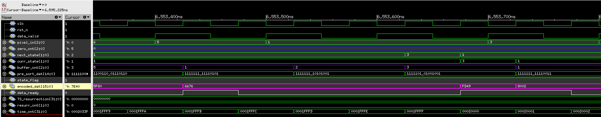

This is not to be confused with the resurrection process's consecutive output of 3 packets.


__SORT__ switch to __ALRM__ process:

```text

1_111_110_dat_dat_dat -> 1_xxx_xxx_xxx_xxx_xxx

```

resurrection process:

```text

1000_0000_0000_0000 -> xxxx_xxxx_xxxx_xxxx -> xxxx_xxxx_xxxx_xxxx

```

where x represents the timestamp

This should address the ambiguity when switching states.


## 11 Mar

As suggested, the time clock can be removed from the module and be used as a global signal, I will now remove time_cnt from the design. 

It should reduce the design area to a much smaller size.

Just re-ran the simulation and it looks the module still behaves alright even after getting the internal counter removed.


Now I am just doing a simple synthesis using my script to get a rough idea of the size after removing the internal counter.

After the simple implementation, the following area can be shown:

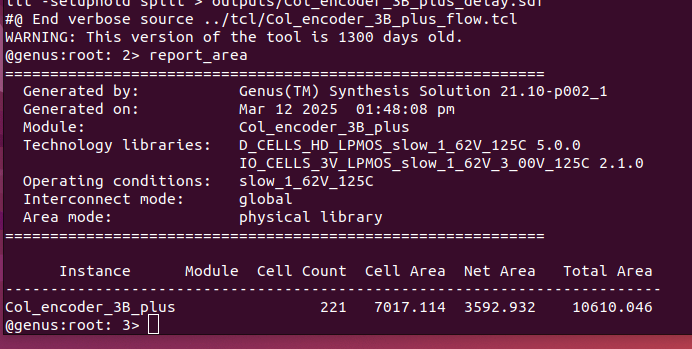

This gives us the total size of 10610.046 um2, which would produce the dimension as 40 X 265.25115

Now I will do a quick place and route

Here is the result of the quick place and route:

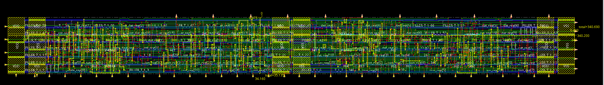

It appears that I can squeeze the design into a smaller size by changing the output pin placement on top and side. 

This results in a DRC clean, timing-met design

This design has the dimension of the following:

**34.160 X 340.200 = 11621.232**


## 12 Mar

Think I should move on to the row based implementation we talked about yesterday.


As discussed I will name our design straightforward as:

Row_encoder_5P  --> deal with 5 pixels at a time 

Row_encoder_10P --> deal with 10 pixels at a time

The 5 pixel one will produce packets like following:

1_dat1_dat2_dat3_dat4_dat5

10 pixel one may need to pack the values into a 32 bit number:

10_dat1_dat2_dat3_dat4_dat5_dat6_dat7_dat8_dat9_datX


When the module encounter a repeating pattern on the pixel value, it will stop sending data until a new pattern appears.

Before the new data was sent, the timestamp will be transmitted over.

it will start with value 0:

0_xxx_xxxx_xxxx_xxxx


So far we are expecting a global timer with a 48-bit counter,

If we are running at 20MHz, this would give us the in total time length of:

$$\frac{1}{20,000,000} \times 2^{48} = 14073748.8355328$$

This will give us 3909.374676537 hours of counting time.


## 13 Mar

Started implementing the simple design.

Even though I do not think this design will be significantly compressing much information.


## 17 Mar

I have tried to implement the mentioned 3-bit, 5-pixel row based compression module, but it appears to me that processing data in the real time is difficult.

Technically, at our **ALARM** state, we should report **8000** to mark the loop around of our "second" meter (least 15 bit counter of tiktok).

Imaging the case where the module is outputing data but interrupted by an alarm like following:

```text 
pixel_in 		pixel_buffer 		encoded_data 		tik_tok		

 36AB              0000                0000              0:5:97
 24BB              36AB                36AB              0:5:98
 612C              24BB                24BB              0:5:99 ----> ALARM triggered
 5244              612C                ????		         0:6:00 
```

we would not know what we should output in this case because in the designed algorithm, alarm and data output has the same level of priority.

Therefore, the designed the module cannot process non-stop data flow in real time, it needs a pause for for alarm output before resuming the data output.

So the definition of "timestamp" should be more clear, should it be the record of the pixel output? Or the absolute time?

```text 
pixel_in  		row_count  		absolute_time
      			(option A)       (option B)
 36AB 			 	0  				0
 24BB  				1               1
 612C  				2  				2 
 5244  				3 				3 
  |  				|               4
  |                 |               5
 36AC               4               6
```

From my understanding, to implement a global time counter, we should use absolute time instead of row count, but this would result in the desynchronisation between the pixel values and actual time the pixel values were produced.


I am considering the possible solution can be implemented. But we can only delay the process for at most 1 clock cycle.

In this solution, I will run the compression module at **40MHz** instead of **20MHz**, so that I can process the pixel values at half of the timestamp increment step.

```text 
pixel_in 		pixel_buffer 		encoded_data 		tik_tok							  

 36AB              0000                0000              0:5:97									
 24BB              36AB                36AB              0:5:98								
 612C              24BB                24BB              0:5:99 ----> ALARM triggered 	
 5244              612C                8000		         0:6:00 ----> Send special packet 			  
  |				   612C				   612C				 0:6:00 (half timestamp) --> output the data       
 25CC			   5244				   5244              0:6:01
```

In the cases of the repeating pattern:

```text 
pixel_in 		pixel_buffer 		encoded_data 		tik_tok							Saved_TS  

 36AB              0000                0000              0:5:24							 0000	
 24BB              36AB                36AB              0:5:25							 0000
 24BB              24BB                24BB              0:5:26 						 0000
 24BB              24BB                 X		         0:5:27 			  			 0000
 24BB			   24BB				    X				 0:5:28        					 0000
 25CC			   24BB				   	X                0:5:29 ----> record the TS ---->0000
  |				   25CC				   8029 (29)         0:5:29 ----> ha24BB
 5608			   25CC	  			   25CC				 0:5:30 
 3200			   5608				   5608              0:5:31
```

And it seems that we do not even need to save extra timestamp to make it work, all we need is to double the clock speed but to make timestamp increment on 20MHz.


## 18 Mar

I will now fixing the implementaion using this new solution.


So far it seems that the transition between IDLE and PUSH has been correct:

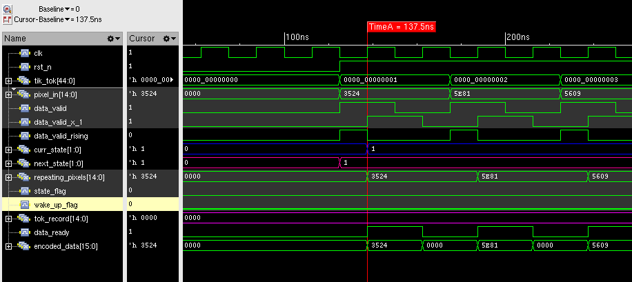


And the saving and output of the data has been correct.


Then the wait state where there is repeating pattern has been recognised, the state transitioned from PUSH to WAIT:

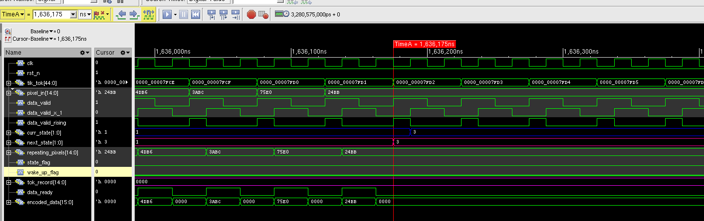


During WAIT state, the alarm went off, therefore the special packet 8000 were successfully sent:

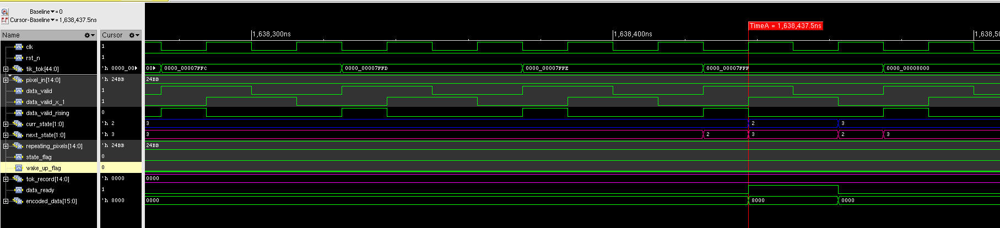


Then the module switch back to PUSH from WAIT becuase the input data is different:

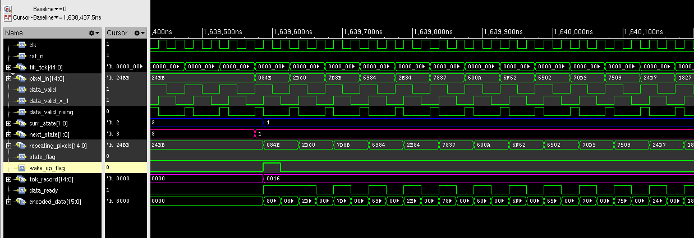


But the problem occured when the module tried to switch from PUSH to ALARM and then back to PUSH:

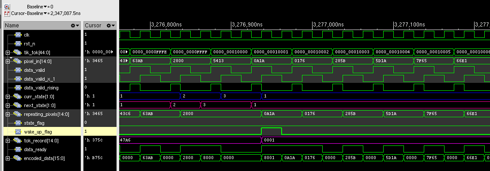


It accidentally switched to state WAIT after switching back to ALARM, this is because the state flag was not set when it switches to state ALARM.

After change the logic, it now will correctly flag up the state so the state swithcing is correct.

But we will lose one packet of data if there is data change during state ALARM. Therefore, extra care was taken during ALARM to make it save the changed data if there is new data during state ALARM.

Now the behaviour is correct:

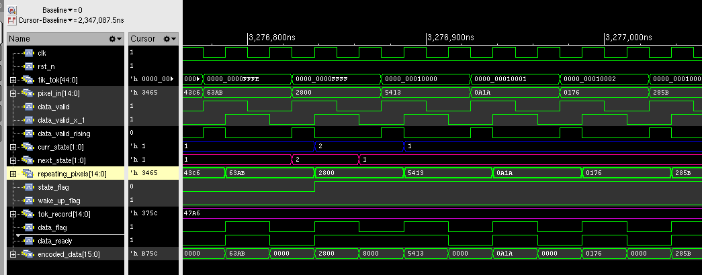


Satisfied~~~


## 19 Mar

Now I am finishing up the flow of the design of the row based encoder.

Synthesis flow is now finished, and apparently, the area is much smaller.


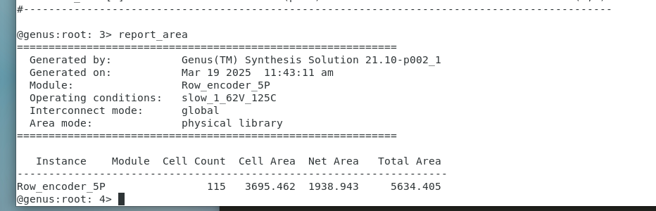

Now I am finishing up the design of the layout for this design.

Since this is for a module that matches 5 pixels, which should allow us 100 um for width.

Just found a bug in my rtl code where "data ready" signal was driven by multiple module, therefore caused this signal to be synthesised incorrectly.

now re-run the synthsis... In the same time, I did not use the titktok bit after bit 15. This has been disconncted by genus.

 
The updated area of the synthesised result of the design:

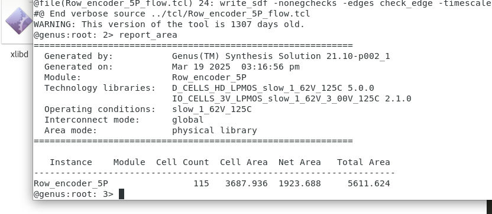 

possible floorplan dimension tried in innovus:

89.060 X 151.830 =  um

But during place and route, I found that the tool synthesised scan chains for this design without my command.

I am gonna have a look about it.

I do not know why Genus synthesised scanned registers for some internal registers like repeating_pixels and tok_record, the common ground of these two is that they are constaly getting compared and saved if needed.

For example, it inserted the repeating_pixel_reg using a scan register:

```verilog

  SDFRRQHDX1 \repeating_pixels_reg[1] (.RN (rst_n), .C (clk), .D
       (repeating_pixels[1]), .SD (pixel_in[1]), .SE (n_82), .Q
       (repeating_pixels[1]));
```

Where this value might get updated if n_82 is 1, this matches the functionality, but causing some issue here.

But after the simuilation check, it appears that the logic overall is correct.

I think it might be due to the fact that syn_map_effort has been set high by default, I have now just added the following line in the script:

```tcl
set_db syn_map_effort medium
```

I will see how this comes out.

Okay, this did not change a thing, I guess I will have to limit the use of scan register during synthesis.


Think I will have to manually block the cells from being mapped.


## 20 Mar

I still have not been able to find the exact command to exclude the cells from being used.

Will keep on searching for it.


So apparently, I cannot change the attribute of a batch of library cells.

But I can change the feature of a single library cell feature using the following command:

```tcl 

set_db lib_cell:default_emulate_libset_max/D_CELLS_HD_LPMOS_slow_1_62V_125C/SDFRRQHDX1 .avoid true

```

And you can navigate library cells using the following command:

```tcl 
@genus:root: 33> vcd libraries/
@genus:root:.libraries 36> vcd base_cells/
@genus:root:.libraries 39> vcd SDFRRQHDX1
@genus:base_cell:SDFRRQHDX1 40> vls -attribute
```

This will display the attribute of this cell:

```text 
Total: 3 items
./                            (base_cell)
    Attributes:
      area = 70.2464
      base_class = core
      base_name = SDFRRQHDX1
      bbox = {0.0 0.0 15.68 4.48}
      class = core
      escaped_name = SDFRRQHDX1
      is_flop = true
      is_rise_edge_triggered = true
      is_sequential = true
      is_timing_defined = true
      lib_cells = lib_cell:default_emulate_libset_max/D_CELLS_HD_LPMOS_slow_1_62V_125C/SDFRRQHDX1
      name = SDFRRQHDX1
      obj_type = base_cell
      site = site:core_hd
      symmetry = xy
base_pins/                   
pg_base_pins/                

```

After setting this cell as avoid, the synthesised results used another scan register for our design.

SDFRRQHDX0

After blocking the mentioned one, it will just use another scan register

SDFRRQHDX2

I will just go with DFT flow...

So far it seems that I can continue with the DFT flow, but another constraint SDC file needs to be written to meet the timing needs.

The size of the implementation can may be finalised in just 88.45 X 153.72 = 13,596.534 um2

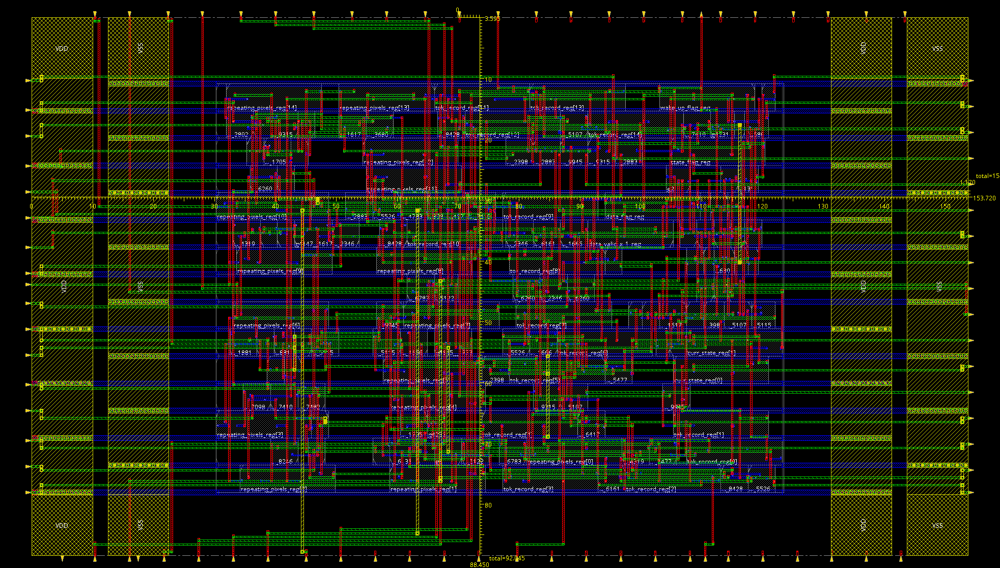

and so far it seems the routing can be problematic especially near rear power stripes...

For example, power stripe used METAL4, input signal used METAL 3, so it cannot use other METAL layers to finish routing when there are vias from METAL4 to METAL1.

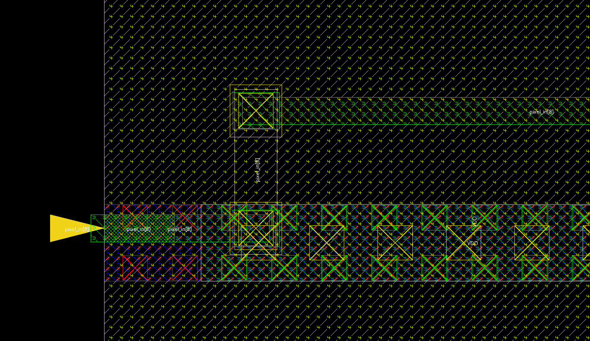


I will also now start updating my script so that I can use DFT flow during pnr.


## 24 Mar

Maybe I will keep on going with the pnr implementation and see how the routing will be...

I have finished early global route and the it seems there is no routing congestion.

What is coming up next should be clock tree synthesis, and also because I did not prepare a different constraint file for scan mode and functional mode, the hold time for this design is not good.

After changing the SDC file content and update the constraint mode, the hold timing issue with functional bits is now resolved.

Now I should do clock tree synthesis...

Finished the whole layout design, thanks to the wide space left during floorplan, the design came back with 0 violations for DRC, antenna and connectivity.

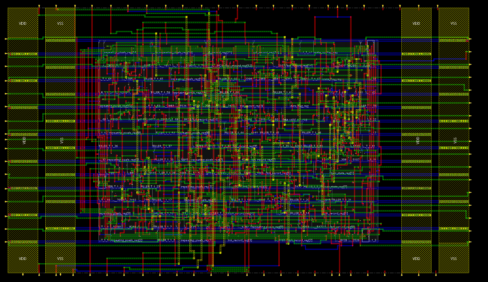


Probably I should continue with another implementation or algorithm.


## 25 Mar

I will now proceed with 10 pixel design, but this has to be carefully designed.

For this row based compression scheme with 10 pixels, it will be called Row_based_encoder_10P


```text 
There is a global timer that will increment over 20 MHz with a total length of 45 bits long

It will take 10 pixels and last 30 bit of timestamp in and process similarly like 5 pixels

Normal data mode:

There is no repeating pattern, the output data should be 00_dat_dat_dat_dat_dat_dat_dat_dat_dat_dat.

When there is the repeating pattern , the module will halt outputting data until this pattern is broken.


When timer loops around:

The module shall output the special packet 10_00_0000_0000_0000_0000_0000_0000_0000

8000_0000


When the pattern is broken:

The module will first output the timestamp (the last 30 bit of clock counter) 01_TimeStamp_minuteAndSeconds

This will then be followed by the actual data.


```

Also I have been thinking about how downsampling should be done.


## 27 Mar

Sick yesterday, so I will start working again today.

will continue the 10 pixel row based compression.


## 28 Mar

Now continue the implementation,


## 31 Mar

The implementation is easy enough to be implemented, so I would assume it should behave alright.

And the simple testbench shows that it is doing what I want it to do.

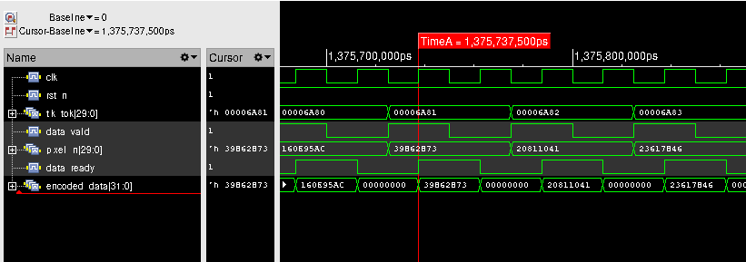

And the transition from push to WAIT is correct when there is a repeating pattern.

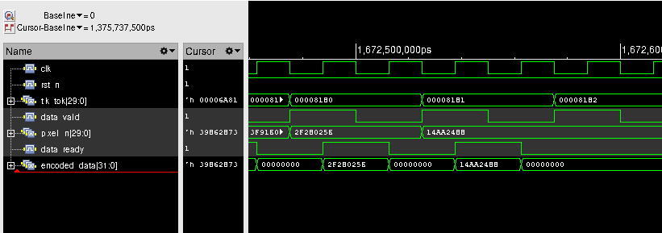

And of course the transition from WAIT back to PUSH has also been correct.

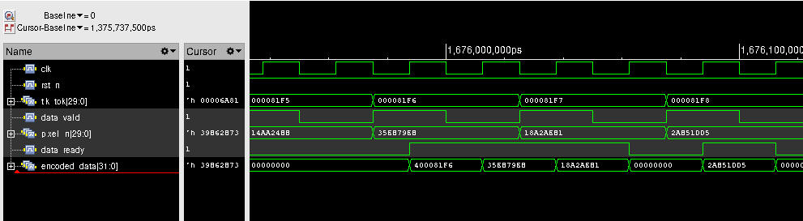

Where it will first output the timestamp where the unrepeating pattern happened and then followed by the pixel values and then new pixel values.


The synthesis flow now has added DFT scan registers, and this gave me the total area of 12,404 um2

Also, I need to update the Gen_doc_pnr script to involve dft flow.

I have just now added the support for DFT support on the automating script Gen_doc_pnr.

But I do realised that the output constraint SDC file still contains library specific information like the following:

```tcl 

set_driving_cell -lib_cell INHDX1 -library D_CELLS_HD_LPMOS_slow_1_62V_125C -pin "Q" [get_ports rst_n]
```

The library **D_CELLS_HD_LPMOS_slow_1_62V_125C** used in synthesis may not be the one chosen by the user, this has been set as default in synthesis.


## 1 Apr

Now I should finish the implementation of the 10 pixels design and see what the layout looks like.

Also realised after cheking the reminder saying adding the filler after route requires eco route to avoid DRC errors.

This is a lessson to be remembered.

But this is an easy fix.

and the final layout looks like this:

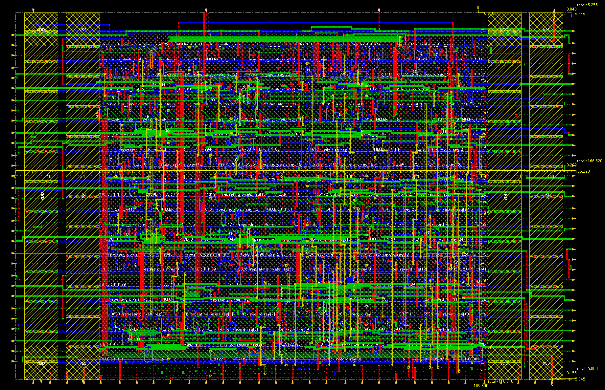

This layout gives a total area of 8063.283 um2, think this is just the die area...


cus the total dimension of this layout is:

109.80 X 166.32 = 18261.936


## 2 Apr

Now I am actually curious about the UMC documnets Steve sent me.

So I think we do not have the UMC65 PDK installed yet, but it seems we may be able to access it with no problems.

Will now move on to the python implementation for the compression algorithms.

I will verify the implemented column based and row based algorithm and also try and see if I can implement some more entropy based algorithm.


## 4 Apr

I should now probably move onto the test for hardware modules, where I would try to feed the module with simulated data and see how that would the encoding process will be like and what the data rate will be.

Also I have been reading about the entropy for 2D images, this shall give me ideas of how to characterise the image's complexity in terms of its entropy. I have found a github repo where the delentropy and deldensity was implemented, it will be looked into.

In the meantime, I will address all the accumulated questions we had in the past.

First, let us look at the delentropy implememtation, the github repo I found was written in Go, I will see how I can rewrite them in python.


The delentropy topic will take longer than expected, there are more fine details I need to iron out before a python implementation.


Next, let me see if there is any accumulated quesitons I can try to figure out now.

Think there is this question:

**Is the FIFO going to benefit with a more arbitrary word length?**

I shall update this in the excel DPRAMLP_solutions_comparison.xlsx


And yeah, I think the conclusion is that as for smaller bits, the size of the ram will be smaller.

Think the relationship in terms of the bit width and word length to the size is linear, so yeah if we have a irregular size need for the buffer, it will end up getting us a smaller size of RAM.

I think this is basically it.


## 7 Apr

I shall now start trying using Cocotb to run the test for the compression module on the "real" data to see the output data rate.

I have made a simple testbench on the implementation of the 5P encoder using cocotb, and it is showing that the running has been correct, generating stimulus is also easier than writing a testbench.

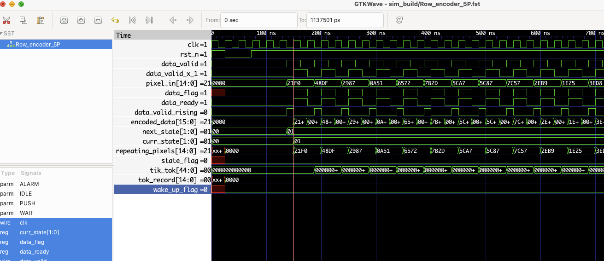

Think it shuould be easy now to dump the generated data into the moudle for quick test and data collection.


## 8 Apr

Think I can first do the test on the simple single particle images and then check the more realistic images.

Working on it.....

Now I am trying to set up the testing~~~

And also I did a small testing where the monitor was written up as a coroutine and got "forked" into the process, this monitor will be up and running with the testing simultaneously and then print out the monitored value.

This has prove to be effective:

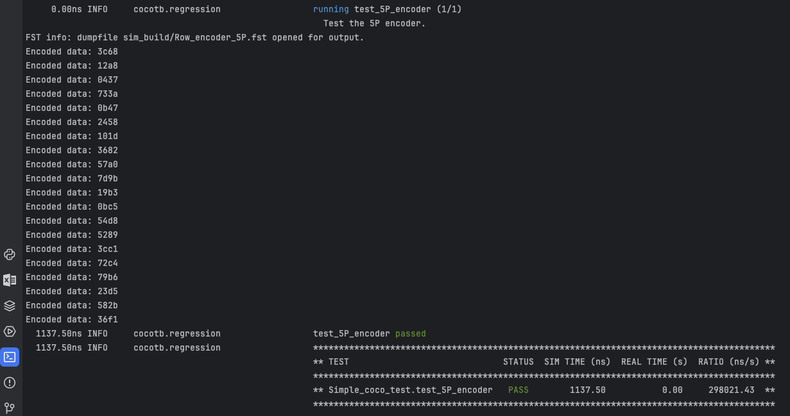

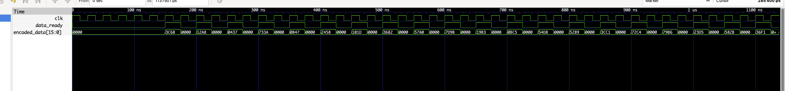


## 9 Apr

I will now start testing just one sub-channel with a monitor coroutine that would write into a text file.

I have managed to quantise and split the data of Column B and use that data to feed the module in cocotb.

Below is the simulation waveform from the simulation.

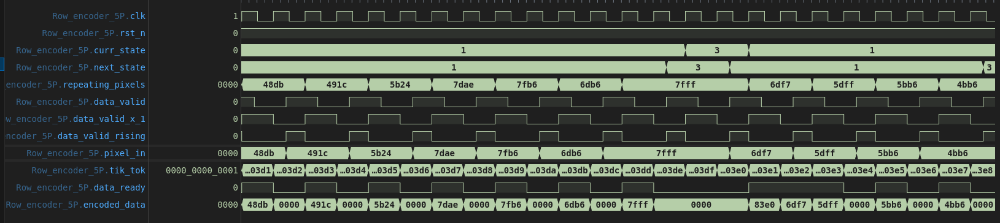

And the monitor I wrote will write the observed data into a text file and it can be seen that the data matches the waveform:

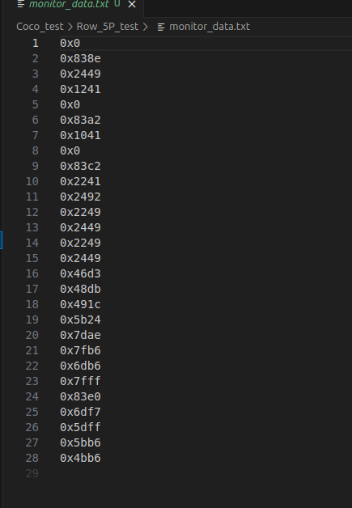

Now I can extend this test structure into the entire image, instead of a single sub-channel.

This will require me to write a more level-up testbench that will restart the simulation every time for 200 times.


## 10 Apr

I have just finished implementing the testfactory where it will loop the same time for 2 times using the same test structure and test module, but with different test cases.

According to the simulation wave, it is running sequentially with one test case after another, this should be fine given that we have the test will always rest the module before feeding the data.

The following console content shows that 2 different tests were done sequentially with each one taking 51060 ns.

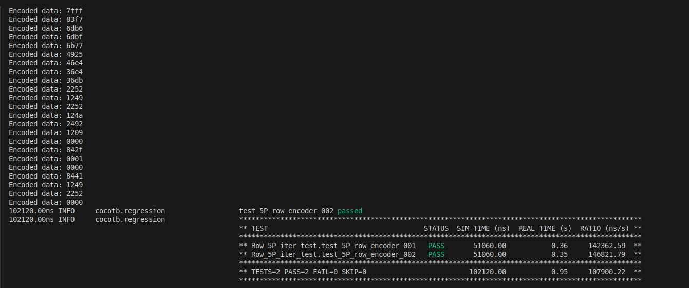


Also I managed to write the monitored data into a single text file, where the shared text file will be opened before tests and written some lines before getting more appended content in the coroutine which will be repeated for 200 times.

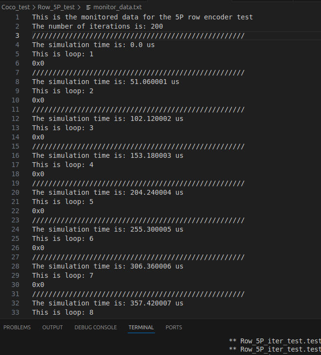

The displayed text file was based on a sliced quantised column B image which has a dimension of (1000, 1000), therefore our test will need to be repeated 200 times.


## 11 Apr

I will implement the testing for the 10 pixel row encoder module.

This is very simple, all I need to do is change some minor parameters.

Very quickly, the test is finished for Row_encoder_10P

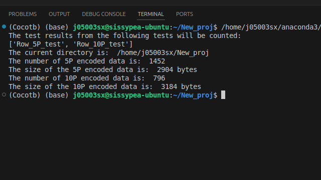

the collected results show that for the same image, 5 pixels row encoder have slightly smaller data size in total where it has 2904 bytes while the 10 pixels row encoder has 3184 bytes

I should have a look again at the image that we might be able to generate that is long enough for us to run the simulation.


## 14 Apr

I will now clone again the data generation repo and see if I can generate an extra long image using the repo.

Found the code where the data generation can be done using the compositePSD and a little time, the example demonstrated the generation where a cloud volume of 0.1 by 1 by 0.2 m3 and the image sensor is put in the cube centre and offset by half of the arm separation in the vertical dimension.

The generated images showed image of 2560 um by 10000 um, think these 2 parameters were defined in these two python statements:

```python
	## The detector has been defined at centre of the cloud volume with 256 pixels and each takes 10 um
	detector = Detector(np.array([0.05, 0.5, 0.1-arm_sep/2]), n_pixels=256, pixel_size=10e-6, arm_separation=arm_sep)
	## the cloud will take images for 0.01 m, which is 10,000 um
	run = cloud.take_image(detector, distance=0.01, single_image=True)
```

Where the first sentence instantiates a detector at the centre of the cube with the pixel size and numbers, and the second statement decided the image will be 0.01 m long.

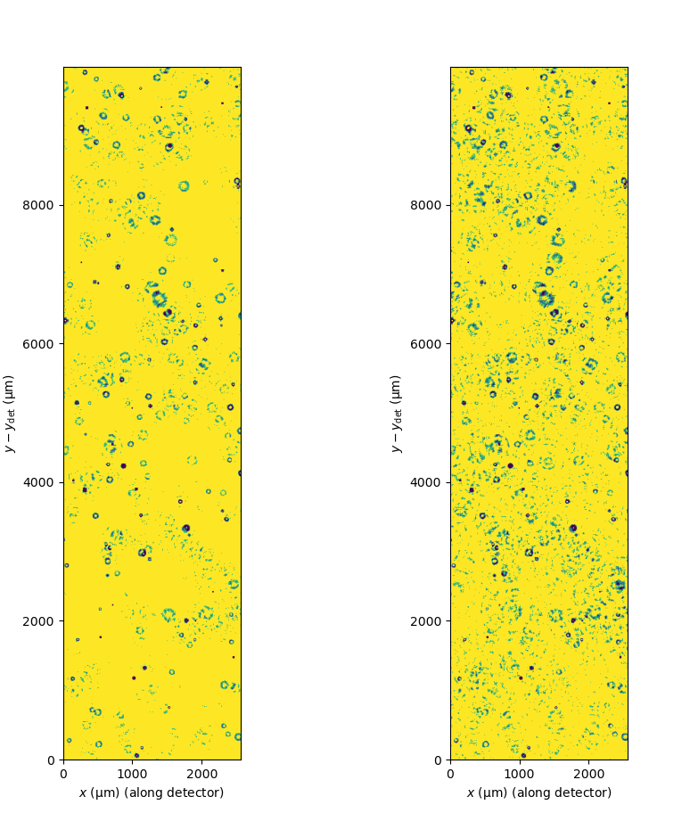

Think I may be able to use these methods to generate our own images.

but the process is gonna be slow.


## 15 Apr

Now I will try to imitate the script example and generate my own images.

So I have managed to save and extract the image data in a pickle file.

And to extract the image, you should take the image array from "image_array_2 = run_2_data.images[0].amplitude.intensity.field"


And that is how I got this image:

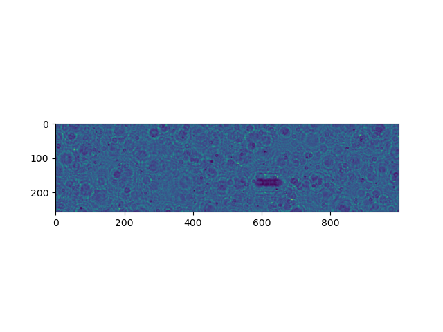


## 16 Apr

I can actually just use the 256 pixel image first and then run the simulation, then also incorporate a FIFO.

Or I can write out the monitored data and the time stamp and then write a python script to see how big the fifo size it needs.

also I am wondering what the relationship it is between the amplitude.field and amplitude.intensity.field, amplitude.field is an array of complex numbers while amplitude.intensity.field gives an array of float64.

By observing the python script, I think my guess is correct. The image that was plotted is the image.intensity.field and it has been applied with a boundary of "[0] + grayscale_bound + [2]", it capped the max intensity to 2 and the min intensity to 0.

I guess also my question is, do we need to limit our intensity value within the range between 0 and 2?

This is a little different from what Jonny has sent me, where the data range is from 0 to 1.


I have now just saved the simulated data into a more independently readable file in ImagedRegion_press.npz

I will get back to this tomorrow and try to quantise it using the boundaries set in the data_generation script and see if I can replicate that image.

I will now try to plot the saved images in the style given in the generation script.


Just as expected, the images recreated from the intensity file look the same as before.

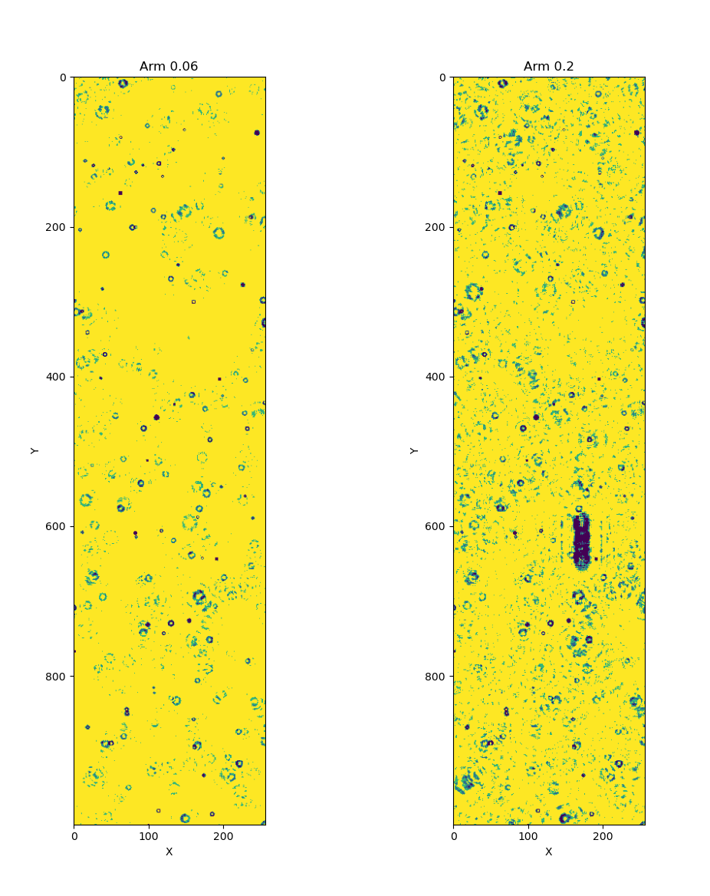


## 17 Apr

From what was tested yesterday, I think I can quantise the images based on my understanding.

Think I will now also implement an 8 pixels row encoder so that they can be fit into the number of pixels of 256.

This should be easy, and all I need to change is some input and output

I also just realised that I do not have enough time gap to send off the complete timestamp. This is because the input data rate is 20 MHz, and my design works at 40 MHz so I only have 1 extra clock cycle to write or output some random information other than the real data.

If I need to output the complete timestamp (possibly 3 encoded data), I need a buffer at least the size of 2-4 row before the encoder so when there is a change in pattern, we need to be able to output both the complete timestamp and the change of the data.

I will focus on the implementation of the 8 pixel or 16 pixel encoder module implementation so I can at least have a test.


