# Algorithm of Compression reimplementation 
# AKA project Elphaba

## 25 Nov

I have read through the students' C code, think I now have a general understanding of how it works.

Now I will try to implement the algorithm in python.

This project will be named as Project Elphaba, cus this is where the magic is.


After observing the C code again, I think the student did the data generation using a certain level of density for a certain crystal and then randomly generate a position to be embedded.

And there are only 3 types of particles: small (sphere), medium (rectangular AR5 ROT) and large (Rosette)

It first calculates how many particles of a certain type there will be, and then generate a particle in this cube. As for the diameter of this particle, it will be randomly generated by a gamma function which has a fixed average and variance.


## 26 Nov

There are already generated data files on the microsoft teams folders.

UoM-G-MLU:

Documents > Next-Gen Optical Array Probe > Simulation Data > data files

There is a document describing what these data files are, they are all .h5 files.

The impact of the threshold, and 2-bit/3-bit and how that would affect our compression.

Important greyscale values for thresholds

30-40% 50% 65-67%


1 is no blockage bright, 0 is all blocked no value.


Ok, so I have just viewed the images in the sharepoint that was generated by Jonny, and they are 3D image arrays.

It basically generates a whole sets of 2D images with different Z distance to the focal point, so the image looks from clear to blurry.

Here I attach an exemplary gif to present the images

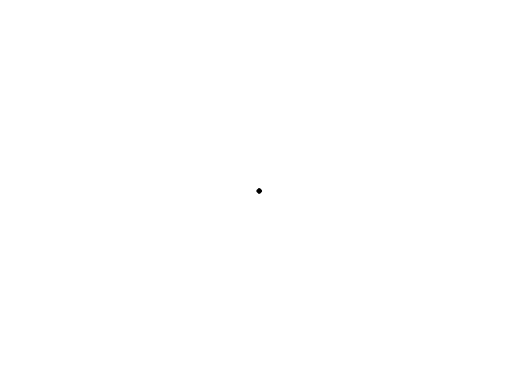

I am not sure if these images are enough for me to test the pressure the FIFO has to face.

But can be a good starting point to implement the compression algorithm.


## 27 Nov

I shall start drafting up the compression algorithm and write them into a class.

I shall start with the most simple one, 2 byte run length encoding (2BRLE).

Finished the implementation of the basic run-length encoding class implementation.

Now doing a simple testing...


Just realised that the images loaded into the class is too big, it is 500 by 500, which will exceed the largest capacity for this class for sure.

Now switching to a smaller image...


Then the tool reports that it only supports integers, and then I realised I have not implement the quantiser yet.

Starting to implement the quantisation class...


<h2 id="image-quantisation-and-presentation-28-nov">28 Nov</h2>

Quantisation class should be also very simple, this shall just follow the given thresholds.

However, I noticed that the generated pixel values needs to be reversed first.

Cus when there is nothing, the value for the pixel is 1.000, I want it to be zero.

This will be implemented as well, but not sure if this is worth mentioning during the meeting.

The quantiser is now implemented with a 2-bit and 3-bit quantiser, where I used a 2-bit quantiser to quantise the image before getting it compressed.

The images below is the uncompressed floating point image of this sphere:

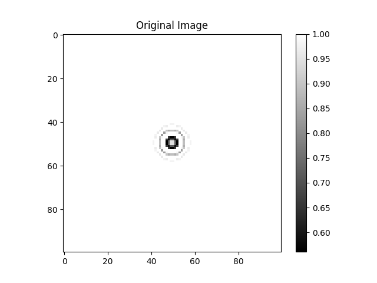

After quantisation, the image is shown below with 4 different integer values, most of the pixel is smeared after quantisation


When it comes to size, after compression, the file only takes 240 bytes without the row-ender (2 bytes of 0 to mark the end of the row).

This would give us a compression rate ($R$) as follow:

$$
R = 1 - \frac{240}{100\times100} = 97.6\%
$$


## 2 Dec

Now that I have already implemented the simple 2Byte run-length encoding, other variations of 2Byte run length encoding should also be implemented.


What comes next should be the 2-byte run length encoding with row difference and special cases considered all zero row and row marker values encoded.


Ok I have just implemented both 

RLE_RD_2B and RLE_AZ_W_RM_2B

and did the same test on the same image, presented in the log in [28 Nov](#image-quantisation-and-presentation-28-nov).

I have got the following results for this image:

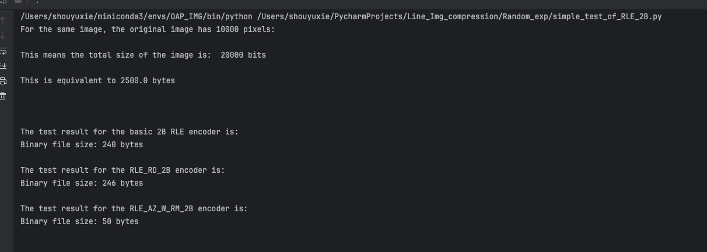


## 3 Dec

After having the meeting today I wrote another class to do quantisation on the image into 3 bits, where steve was talking about the "capped" pixel intensity needs to be considered.

So this new class of quantiser **Quantiser_3B_uniform_dist_INV**, will consider the capped pixel intensity and quantise the rest region into 8 different levels with 7 thresholds.

The following image shows how this would affect the quantised image with 3 bits
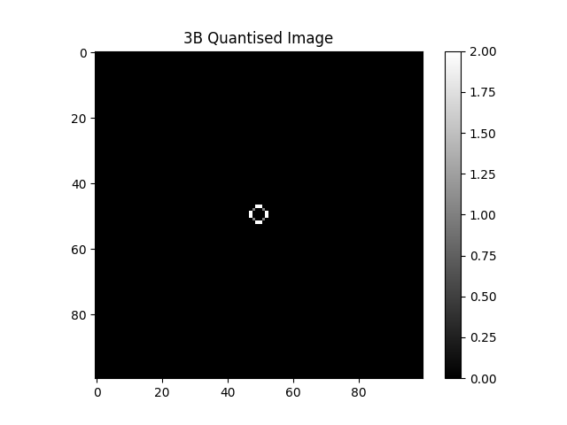

I can also consider adding a method for the encoder to return the compression ratio.


## 4 Dec

Added the method to make the encoder report the compression ratio, this has been fairly easy to implement.

And here reports the compression ratio from the script:
The following compression belongs to the 2-bit images:
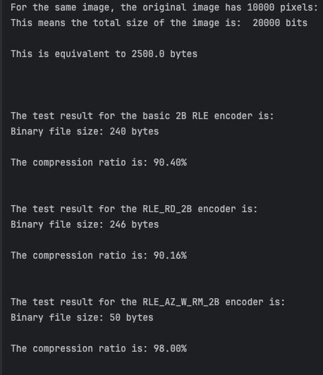

The following compression reports the 3-bit images:
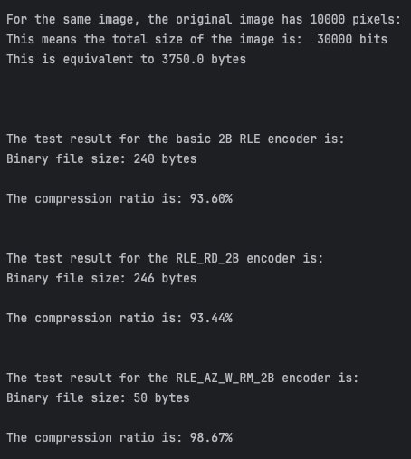

What comes next should be the plot of the compression ratio against the focal position for different droplets.


## 5 Dec

Continued from previous work, I think I should do the experiment now and plot out the comparison figures to see how the compression ratio will be affected by the focal point displacement.


And also because we are dealing with images with more than 256 pixels, I think I should probably add support for different pixel numbers in the encoders.

This should not be a problem for the encoder **RLE_AZ_W_RM_2B**, because this one supports the encoding run length up to 11-bit, which is 2048.

I can add a parameter in the encoder of RLE_2B and RLE_RD_2B, but if I do that the RLE_AZ_W_RM_2B will need to be rewritten as well.

So I am going to write a new class to add variable pixel numbers in the row.

I did a simple scripting and tested the compression rate for the first particle Droplet A with the size of 0.02 and got the figure below:

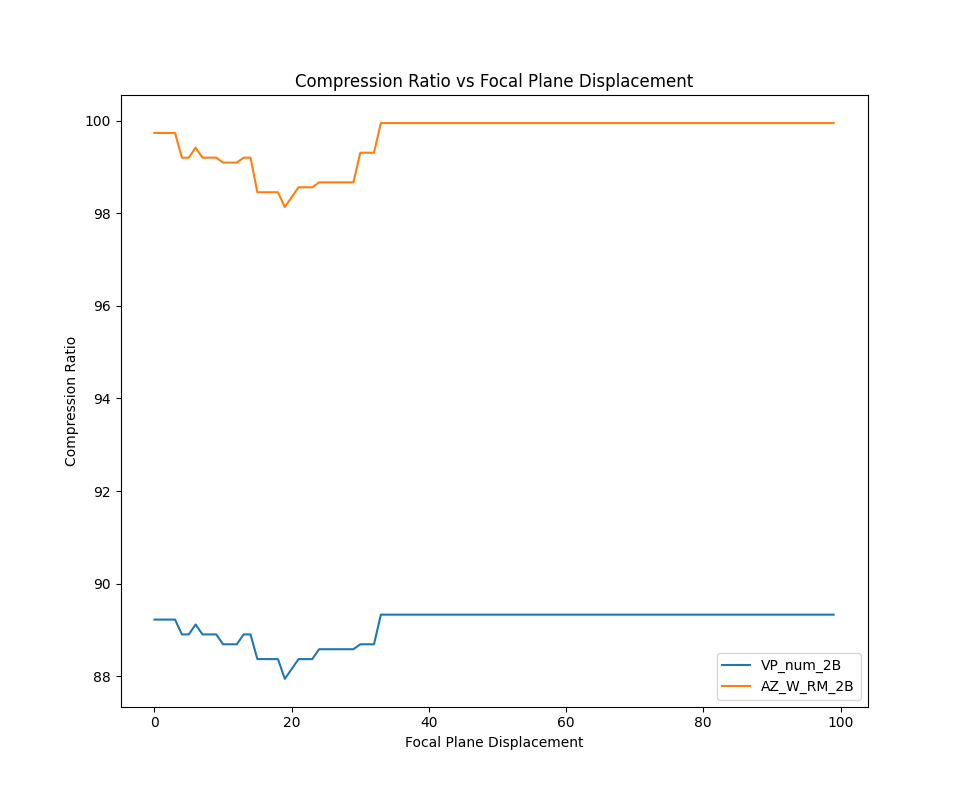

It can be seen that these 2 different encoders have the similar trend towards compression ratio when particles are at different places around the focal plane. The compression efficiency will both first go down and then head up, I can probably do an animation of the quantised image along the focal plane displacement.

And then I got this rather interesting figure, which looks like a pixel game special effect
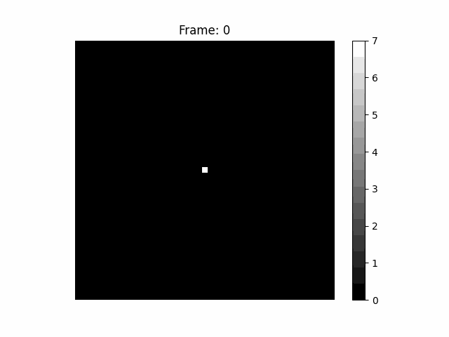

This explains why there might be a valley in the compression ratio figure.


## 6 Dec

Today I shall do the plots for all the droplets with the compression rate vs its focal plane distance.

And I have made all the plots to be presented, it can be seen from the plots that not all the particles have similar trends.

### Droplets

So for smaller droplets, like drop A (0.02 mm) and drop B (0.1 mm), they both experience the compression rate of going down and then up.

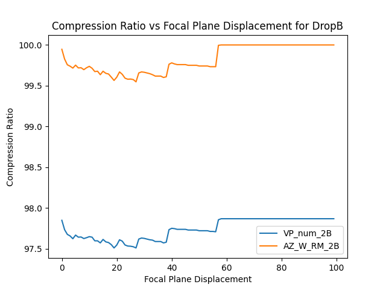

This is because they would fade out when it is further away from the focal plane.

For slightly bigger droplets like drop C (0.5 mm) and drop D (2.5 mm), they would both go down as the particle shifts away from the focal plane.

Even though drop C would actually plateau after a certain distance.

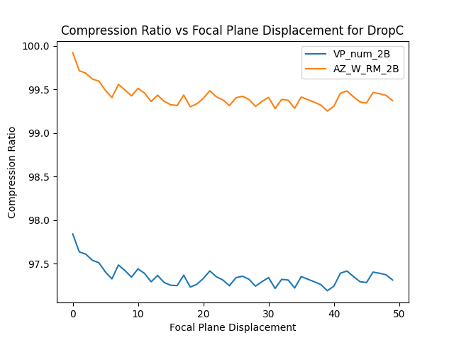

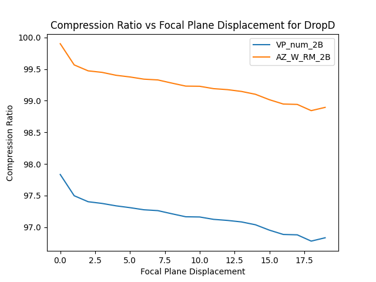


### Columns

They all have the declining trend as the distance increases.

looks like the rotations does not make too much impact in terms of compression ratios.

The particles with the same size but different angles showing similar compression rates like (Col A, Col C, Col E).

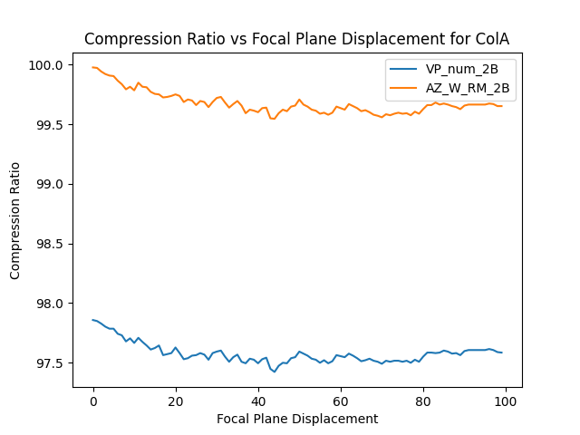
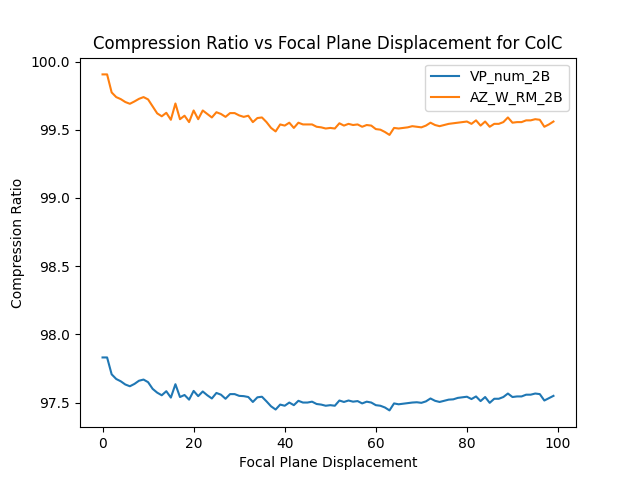
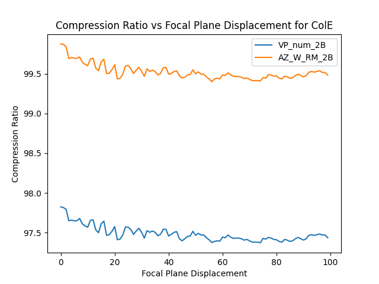

The bigger particles showing stronger declining in this case
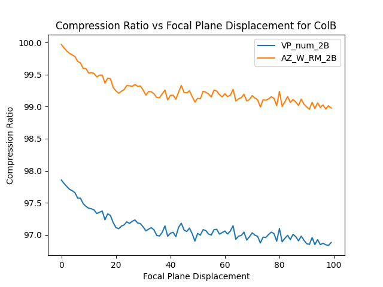
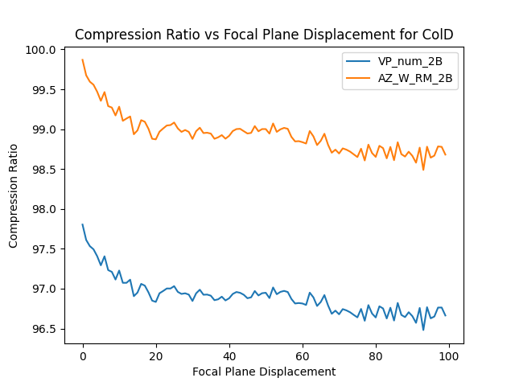
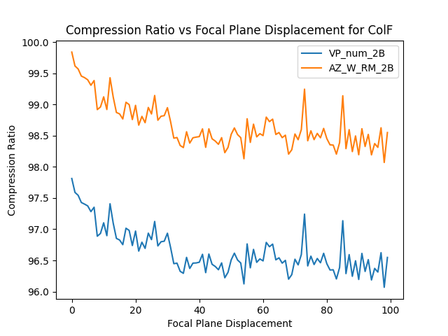

And another thing noticed from these experiments is that when columns placed 90 degress rotated, the compression rate declining gets bumpy as it sits away from the focal plane.


### Rosette

Cases are more complicated when it comes to rosettes, but it seems the overall declining trend still applies except medium sized rosette, where it goes down and then up again.


Still when the particle is small, the compression ratio stays about the same regardless of the distance from the focal plane.

but when the particle gets bigger, especially for size as big as 1 mm, the performance of the encoder gets much worse as it gets more unfocused.

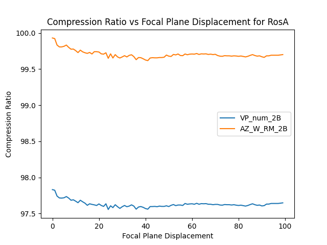
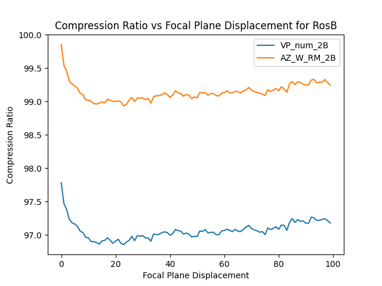
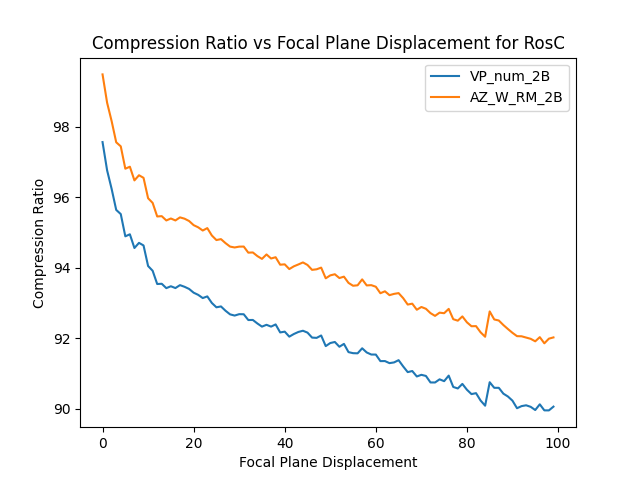


## 9 Dec

Today I shall try to write up the decoder class for RLE_2B.

And in the meantime, I will try to do a little analysis of the compressed data and see how much compression rate it was at the pure blank area and also the rows where there are particles.

And I will also try to make a plot that describes my implementation for quantisation.

I will write up the decoder first and verify if I can recompile the original image.

**Decoder implementation complete** ✅

Now I have finished implementing the decoder:

+ RLE_2B_DEC
+ RLE_RD_2B_DEC
+ RLE_AZ_W_RM_2B_DEC

Which corresponds to RLE_2B/RLE_VP_num_2B, RLE_RD_2B and RLE_AZ_W_RM_2B respectively.


**Making the plot for the newest quantiser complete** ✅

I have now added a graph to illustrate how the quantisation works.


Here is a graph that illustrate the function between the input actual brightness and the quantised value
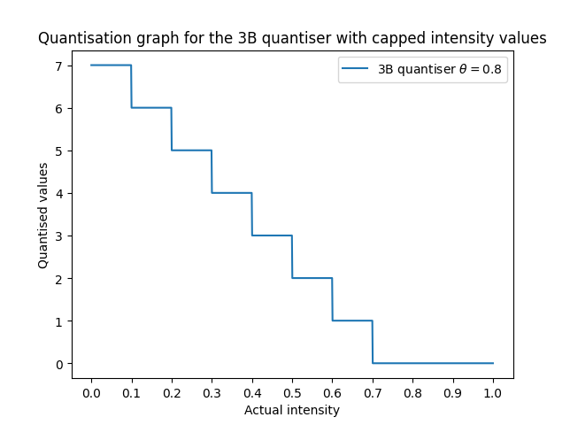


**Analyse the compression ratio at different subregions** 

Did not get to have the time to finish this, will do this tomorrow.


## 10 Dec

Had the meeting today and discussed how the subregion compression rate should be.

And there are some more tasks listed from the meeting:

+ swapping to 2 bits and repeat every testing
+ change the top end threshold and see how that impacts the compression
+ I should also check if the image can be restored
+ slice the images by the time step and list out how much bytes it takes to encode each row

I took one slice of the image and ran a compression rates row by row and plot the image below:
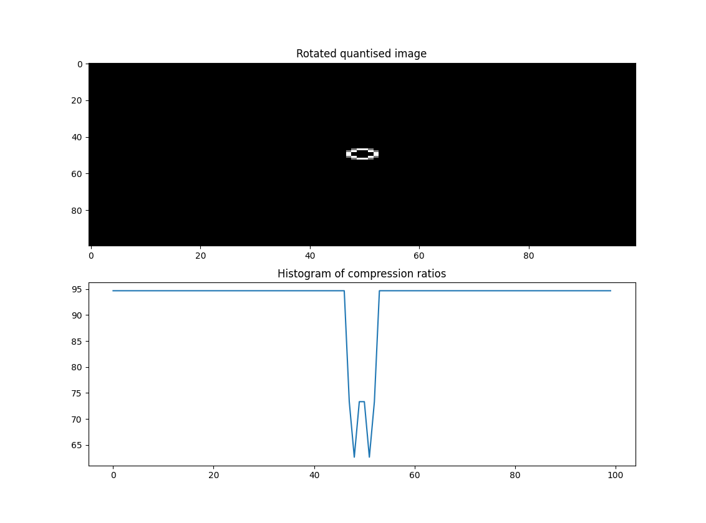

This is the Rosette C image plotted using the same plotting method:
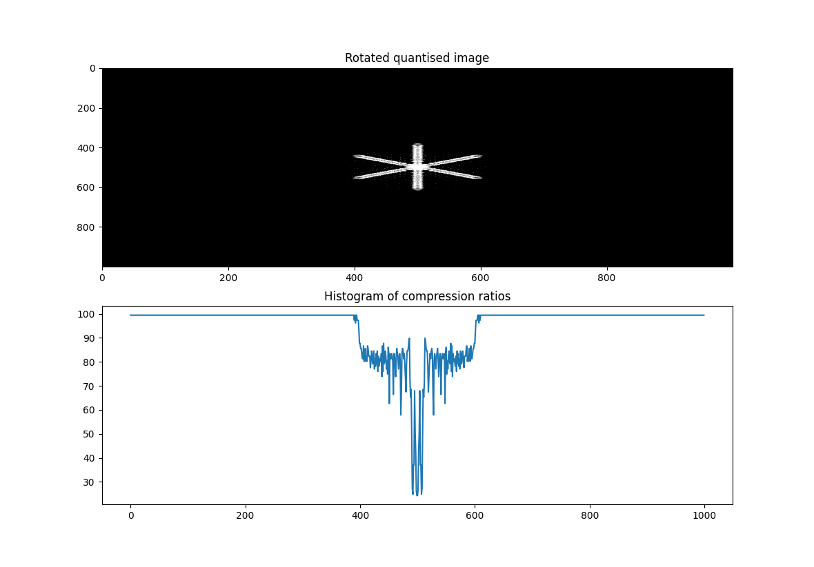

The lowest compression rate for rosette can drop to around 20%, which is not very efficient.


After doing the test, it seems that my decoder cannot properly restore the image from the compressed binary file.

I will need to check this.

After some simple test, I first found that the image cannot be restored at all, it will simply just return all zero images.

Then I found that in the decoder, this line will create a list of list instead of list.

for example:
```python
MT_lst = []
new_lst = np.full((1,3), 2).tolist()
>>> [[2, 2, 2]]
MT_lst.extend(new_lst)
>>> [[2, 2, 2]]
```

This would mean that the length of this new list is 1 instead of expected 3, this would cause the problem when we verify if we have finished this row.

After fixing this, I ran the script again and still failed. Then I found that the decoded image is 1 less row than expected.

And then I found the if-else tree in this one is not correct:

This would mean that the outcome would be one of the 3:

+ all zeros, increment counting
+ not all zeros, but the all_zero_cnt is not zero
+ other case

But the actual logic should only be 1 of 2:

+ all zeros, increment counting
+ not all zeros

if its not all zeros, it would do writing for the all_zero_cnt before encode the row if it is not 0, otherwise, still encode the code.

And the logic now is correct and I have managed to reproduce the uncompressed image.


## 11 Dec

I shall make a sub-channel test on the image and see how much stress each channel is facing when they do the encoding.

I did a test for sub-channel encoding where I took the biggest rosette image and split the image into 10 equally wide arrays, and encode them independently.

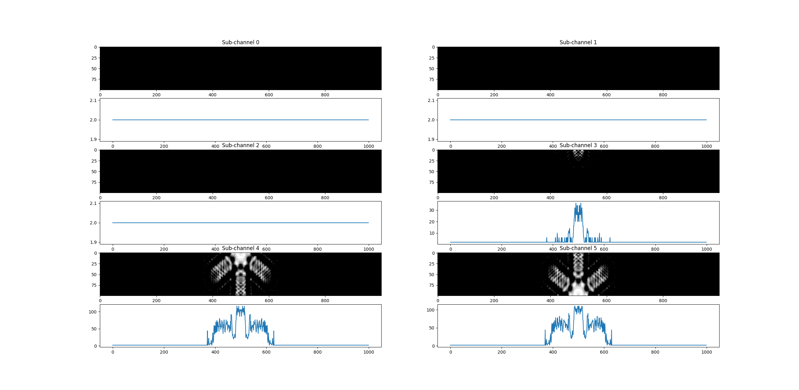

I repeated the test for a spherical particle of size 0.1 mm, and here is what I got.

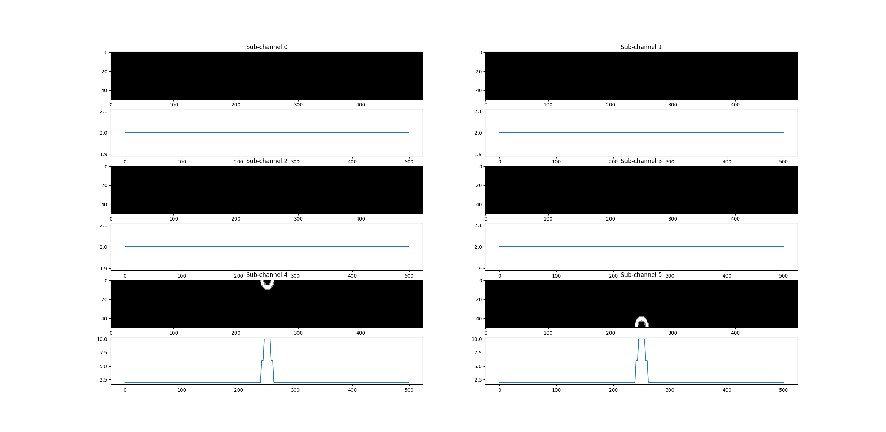


## 12 Dec

I will continue the implementation of the column based compression algorithm today.

Think this is more complicated than I might have expected...

Pushing this to next week to finish.


## 17 Dec

I have finally finished the implementation of the column based encoder.

This **RLE_col_2B** will instantiate a list of simple column based encoders.

When the encode method was called, it will take turns to use the column based encoders to run through the data column by column.

And this proves to be very inefficient.

Much worse than the base line RLE and all zero encoder.

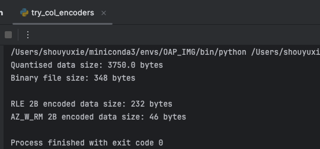


# Xmas New years break


## 6 Jan

I was just reading a image compression algorithm review paper published in 2013 (maybe a little outdated)

Review of digital image compression techniques

Mainly 2 big categories:

+ Lossless compression
+ Lossy compression

They are self-explanatory.


Representative lossless compression includes: *PNG* , *GIF*.

There are a couple algorithms that fall under this category:

+ Run-length encoding
+ Entropy coding
++ Huffman encoding (normally used as the "back-end" to other compressions)
++ Arithmetic coding 
+ Lempel-Ziv-Welch encoding: a LUT based

[A simple discussion about LZW](https://www.techtarget.com/whatis/definition/LZW-compression)


Then lossy compressions have the following representative algorithms (JPEG):

+ Scaler quantisation
+ Vector quantisation

TODO:

Image folding??
Five module method??


## 8 Jan

After reading and learning, I found there might be other options for compression algorithms.

So I would be interested to see how other compression would work.


First LZ77 compression: what it is and how it works

What it is?

It is a dictionary coder, LZ77 maintains a sliding window during compression. 

It achieves compression by replacing repeated occurrences of data with references to a single copy of that data existing earlier in the uncompressed data stream.

A match is encoded by a pair of numbers called a length-distance pair, which is equivalent to the statement "each of the next length characters is equal to the characters exactly distance characters behind it in the uncompressed stream". (The distance is sometimes called the offset instead.)


Howe it works?

1. Initialize Buffers
	•	Start with an empty search buffer and a look-ahead buffer containing the input data.

2. Search for a Match
	•	Compare the prefix of the look-ahead buffer with the contents of the search buffer to find the longest match.
	•	If a match is found:
		•	Record its distance and length.
		•	Move the sliding window forward by the length of the match.
	•	If no match is found:
		•	Record the current character as a literal.
		•	Move the sliding window forward by 1 character.

3. Encode Output
	•	Output either:
		•	A triplet: (\text{distance}, \text{length}, \text{next symbol}), if a match is found.
		•	A literal: The unmatched character, if no match exists.

4. Repeat Until the End
	•	Continue until the look-ahead buffer is empty.


example python implementation:

```python
class LZ77:
    def __init__(self, search_buffer_size=20, lookahead_buffer_size=15):
        self.search_buffer_size = search_buffer_size
        self.lookahead_buffer_size = lookahead_buffer_size

    def compress(self, data):
        i = 0
        compressed = []

        while i < len(data):
            match_distance = 0
            match_length = 0

            # Search for the longest match in the search buffer
            search_start = max(0, i - self.search_buffer_size)
            search_buffer = data[search_start:i]

            # Lookahead buffer
            lookahead_buffer = data[i:i + self.lookahead_buffer_size]

            for j in range(len(search_buffer)):
                k = 0
                # Check for matches between search buffer and lookahead buffer
                while k < len(lookahead_buffer) and j + k < len(search_buffer) and search_buffer[j + k] == lookahead_buffer[k]:
                    k += 1

                if k > match_length:
                    match_length = k
                    match_distance = len(search_buffer) - j

            # Record the match (distance, length, next symbol) or literal
            if match_length > 0:
                next_symbol = data[i + match_length] if i + match_length < len(data) else ''
                compressed.append((match_distance, match_length, next_symbol))
                i += match_length + 1
            else:
                compressed.append((0, 0, data[i]))
                i += 1

        return compressed

    def decompress(self, compressed):
        decompressed = []

        for distance, length, next_symbol in compressed:
            if distance == 0 and length == 0:
                decompressed.append(next_symbol)
            else:
                start = len(decompressed) - distance
                for _ in range(length):
                    decompressed.append(decompressed[start])
                    start += 1
                if next_symbol:
                    decompressed.append(next_symbol)

        return ''.join(decompressed)


# Example Usage
lz77 = LZ77(search_buffer_size=10, lookahead_buffer_size=5)

data = "ABABCABAB"
print("Original Data:", data)

compressed = lz77.compress(data)
print("Compressed:", compressed)

decompressed = lz77.decompress(compressed)
print("Decompressed:", decompressed)
```

By running this script, ABABCABAB will be compressed into:

```python
(0, 0, A), (0, 0, B), (2, 2, C), (5, 4, '')
```

## 9 Jan

I am reading an article talking about how PNG works.

Here is the summary:

There are mainly 2 steps:

+ Filterting
+ Compression

**Filtering** basically encode the data in a row with the difference between the prediction using surrounding pixels and the actual value.

For example:

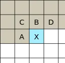

We can encode the value of pixel X with the value of A, B and C

There are mainly 5 ways:

+ No filtering
+ Difference between X and A
+ Difference between X and B
+ Difference between X and (A + B)/2 (aka average)
+ [Paeth](https://www.w3.org/TR/PNG-Filters.html) predictor (linear function of A,B,C)

Here is the image to demonstrate these encoding:

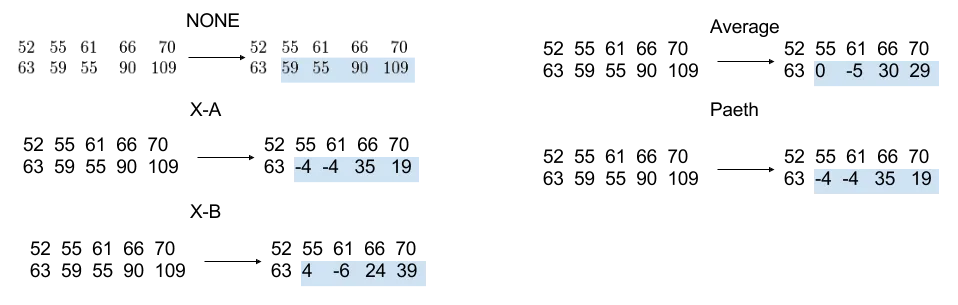

**However, commonly for the optimal efficiency, palatte images and sub-8 bit grayscale images simply use none filtering.**

**Compression**, the step following filtering is also known as **DEFLATE** algorithm. It combines LZ77 coding along with a huffman coder.


Generally a PNG file contains the following information:

**1. Signature bytes**

First 8 bytes are always:

89 50 4E 47 0D 0A 1A 0A

which translates to 

âPNG

This indicates the following file contains series of chunks that starts with an IHDR chunk and ends with an IEND chunk.

**2. Chunk layout**

1> length: 4-byte unsigned integer gives the length of this chunk

2> chunk type: 4-byte chunk 

3> chunk data

4> CRC 4-byte cyclic redundancy check data


## 10 Jan

Arithmetic coding: what it is and how it works

Arithmetic coding is a type of entropy encoding used in data compression that represents an entire message as a single number, a fraction in the range [0, 1).

```text
How Arithmetic Coding Works
	1.	Probability Distribution:
	•	Symbols in the message are assigned probabilities based on their frequency. These probabilities must sum to 1.
	2.	Interval Division:
	•	The range [0, 1) is divided into intervals proportional to the probabilities of the symbols.
	•	For example, if the probabilities of symbols A, B, and C are 0.5, 0.3, and 0.2, respectively:
	•	A: [0.0, 0.5)
	•	B: [0.5, 0.8)
	•	C: [0.8, 1.0)
	3.	Encoding:
	•	Starting with the full range [0, 1), the algorithm narrows down the range for each successive symbol in the message.
	•	For each symbol:
	•	Use the current range and subdivide it according to the symbol’s interval.
	•	The final range after encoding the entire message uniquely represents the sequence.
	4.	Output:
	•	A single number within the final range is chosen to represent the entire message.
```

```text
Example of Arithmetic Coding

Input:

Message: ABB

Step 1: Assign Probabilities

Let:
	•	A = 0.5,
	•	B = 0.3,
	•	C = 0.2.

Step 2: Interval Division
	•	A: [0.0, 0.5)
	•	B: [0.5, 0.8)
	•	C: [0.8, 1.0)

Step 3: Encode the Message
	1.	Start with the full range [0, 1).
	2.	Process the first symbol, A:
	•	Narrow to A’s range: [0.0, 0.5).
	3.	Process the second symbol, B:
	•	Divide [0.0, 0.5) using B’s proportions:
	•	New range = [0.25, 0.4) (since 0.25 = 0.0 + 0.5 × 0.5 and 0.4 = 0.0 + 0.5 × 0.8).
	4.	Process the third symbol, B:
	•	Divide [0.25, 0.4) using B’s proportions:
	•	New range = [0.325, 0.37).

Step 4: Output
	•	The final range [0.325, 0.37) represents the message ABB.
	•	Any number within this range, such as 0.33, can serve as the compressed output.
```

From the look of the explanation, this encoding is computational expensive since it is operating in the floating point number.

The very good advantage is that the whole message can be represented using just 1 floating point number.

But this is not easy to implement in hardware or dynamic encoding.


## 13 Jan


I will need to do some experiments we mentioned last week.


**First question:**

Can we buffer 2k lines of data? How much space do we need?

Think I should make a spreadsheet to discuss this question and analyse the optimal choices of dual port ram.

I shall first do the cases where each pixel has 2 bits of data.

This would give us in total $2048 \times 2 \times 2048 = 8Mb = 1MB$

I listed all the possible solutions with ram block choices for this case and they are saved in the spreadsheet in this folder.

[The spreadsheet](./DPRAMLP_solutions_comparison.xlsx)

Hopefully this shall answer the question for possibility of holding 2k lines of raw data.


**Second question:**

Will it make any difference to encode the images like using interlacing?

 

The image illustrates the staggering pixels layout. Due to the spatial features, green channels and teal channels may have different timing statistics.

Would it make any difference to encode them using an interlacing fashion?

First, for a row of 100 pixels with 3 bits for each pixel, it takes $\frac{100 \times 3}{8} =37.5$ bytes, but according to the experiment carried out on [11 Dec](file:///Users/shouyuxie/MD_log/reImplement_Compress/reImplementation_of_algorithm.html#11-dec), it costs more than 100 bytes for a row at some region, which resulted in a negative compression.

And then, I am considering interlaced compression, so first, a problematic single image of a big rosette shall be split into 2 images.

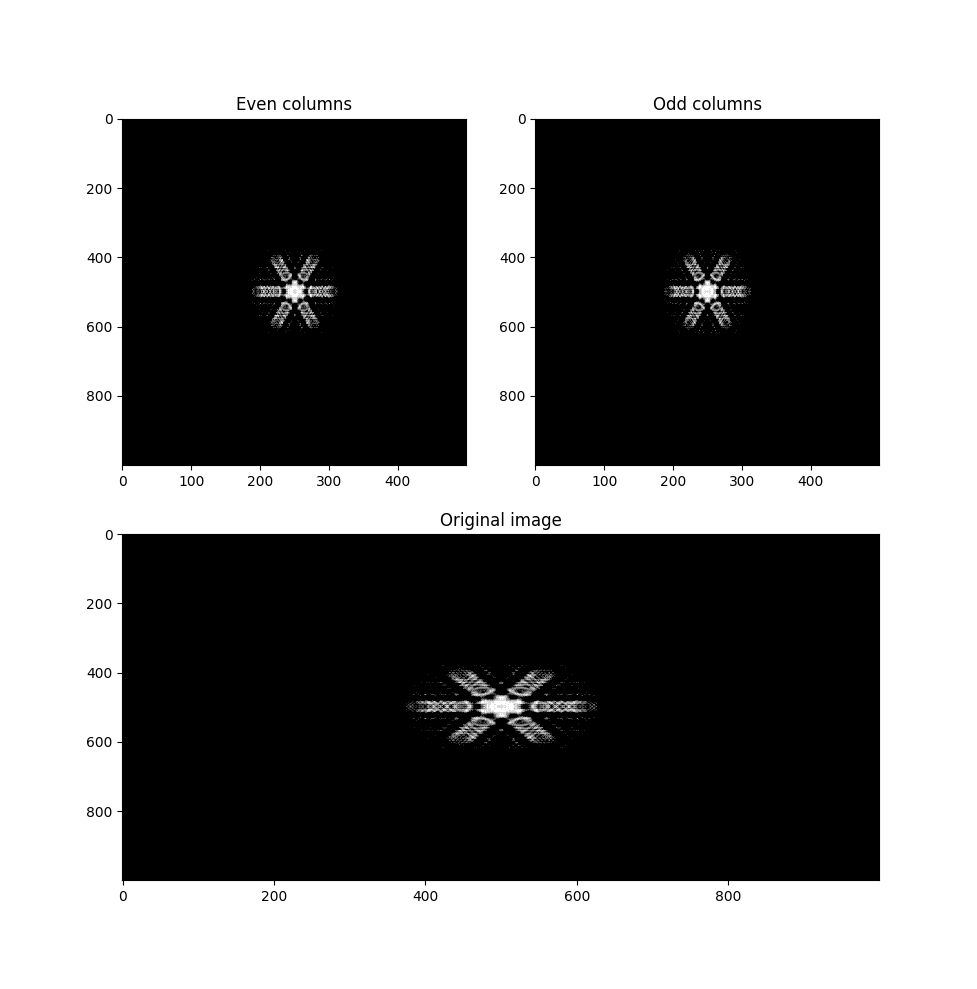

Visibly, they look 3 identical images.

It shows that max storage space needed for a row when it comes to interlaced images is comparable to the original image.

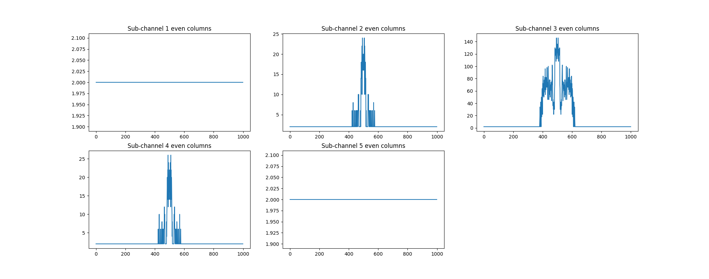

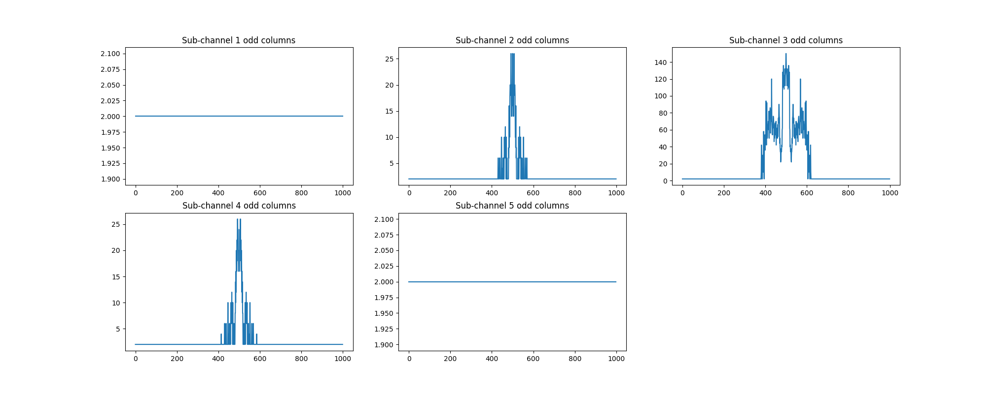

However, when it comes to the original image, the performance for the sub-channel is alarmingly bad.

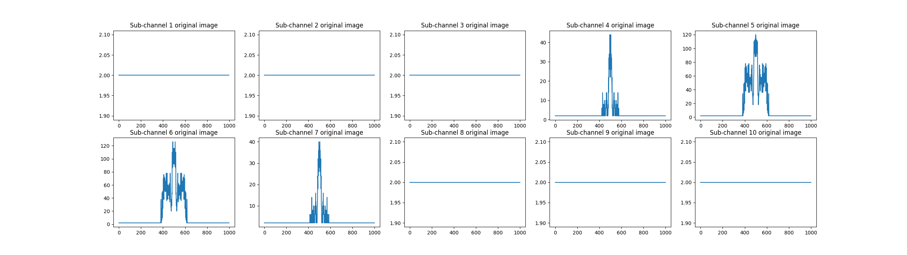

Think the worst performance was shown in figure 6 where the max number is 126 bytes.

But are they equally bad?

Not sure...

And on the side note, it will produce more byte data for 2 divided image than 1 big image using this encoder.

```console
Size of the compressed data for the even columns: 17516 bytes
Size of the compressed data for the odd columns: 17316 bytes
Size of the compressed data for the original image: 28420 bytes
```

## 14 Jan

I am now reading an article about entropy and how to use it.

Entropy is a notion that quantifies a dataset’s level of disorder or unpredictability.

So high-entropy images normally contains more details and more randomness while low-entropy images generally look more "minimalist"

Examples for calculating image entropy using python libraries:

```python
import numpy as np
import cv2
from scipy.stats import entropy

#load image
image_path = 'path/to/your/image.jpg'
image = cv2.imread(image_path)

#convert to grayscale
gray_image = cv2.cvtColor(image, cv2.COLOR_BGR2GRAY)

#compute the histogram
_bins = 128
hist, _ = np.histogram(gray_image.ravel(), bins=_bins, range=(0, _bins))

#calculating the entropy
prob_dist = hist / hist.sum()
image_entropy = entropy(prob_dist, base=2)
print(f"Image Entropy {image_entropy}")

#visualise the histogram
plot.hist(hist, density=1, bins=_bins)

plot.show()
```


## 15 Jan

I have not tried the entropy calculation yet, but found some relative readings:

entropy has been defined in the following formula:

$$H = - \sum_{k} p_{k} log_2(p_{k})$$

Where $p_{k}$ describes the possibility of a certain pixel value in the greyscale image.

But this would mean that this calculation will not take in to spatial information, which means the following 2 images have the same entropy value:

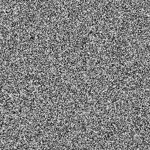


And it is apparent that the image on the left will be more difficult to compress than the one on the right, but they would have the same entropy value, which is not helpful for analysing the compressibility.


There is an algorithm called bzip2, which uses couple layers of compression techniques, such as run-length encoding, burrows-wheeler transform, move-to-front transform and huffman coding.

Here is an example of BWT:

Take the word "banana$" as an example:

Step 1: for all cyclic rotations of the text:

```text
                                     banana$ 
       $    b                        $banana 
    a           a                    a$banan
   Cyclic rotations    ---------->   na$bana
    n         n                      ana$ban 
          a                          nana$ba
                                     anana$b

```

Step 2: Sort the rotations lexicographically. "$" will be even ahead of a

```text
banana$                    $banana
$banana                    a$banan
a$banan       Sorting      ana$ban
na$bana      ---------->   anana$b 
ana$ban    alphabetically  banana$
nana$ba                    na$bana
anana$b                    nana$ba
````

Step 3: The last column is the output:

```text
BWT(banana$) = annb$aa
```

But at the actual implementation, it is generally implemented in the following fashion:

```pseudocode

input_text = "banana$";

# get all the suffix of the input_text and compute the suffix_arr
new_dictionary = {};
for i in range(len(input_text)):
	new_dictionary{i} = input_text << i;

suffix_arr = (new_dictionary.sort_lexicographical).keys;

# output BWT-ed strings
BWT_arr = zeross_like(input_text);
N = len(input_text);
for i in range(N):
	BWT_arr[i] = input_text[suffix_arr[i] -1 + N % N ]
```

an example implementation of BWT in python

```python
# Python program to find Burrows-Wheeler Transform of a given text
# Compares the rotations and sorts the rotations alphabetically


def cmp_func(x, y):
	return (x[1] > y[1]) - (x[1] < y[1])

# Takes text to be transformed and its length as arguments
# and returns the corresponding suffix array


def compute_suffix_array(input_text, len_text):
	# Array of structures to store rotations and their indexes
	suff = [(i, input_text[i:]) for i in range(len_text)]

	# Sorts rotations using comparison function defined above
	suff.sort(key=lambda x: x[1])

	# Stores the indexes of sorted rotations
	suffix_arr = [i for i, _ in suff]

	# Returns the computed suffix array
	return suffix_arr

# Takes suffix array and its size as arguments
# and returns the Burrows-Wheeler Transform of given text


def find_last_char(input_text, suffix_arr, n):
	# Iterates over the suffix array to
	# find the last char of each cyclic rotation
	bwt_arr = ""
	for i in range(n):
		# Computes the last char which is given by 
		# input_text[(suffix_arr[i] + n - 1) % n]
		j = suffix_arr[i] - 1
		if j < 0:
			j = j + n
		bwt_arr += input_text[j]

	# Returns the computed Burrows-Wheeler Transform
	return bwt_arr


# Driver program to test functions above
input_text = "banana$"
len_text = len(input_text)

# Computes the suffix array of our text
suffix_arr = compute_suffix_array(input_text, len_text)

# Adds to the output array the last char of each rotation
bwt_arr = find_last_char(input_text, suffix_arr, len_text)

print("Input text :", input_text)
print("Burrows - Wheeler Transform :", bwt_arr)
```

## 16 Jan

Following the reading of BWT, I also checked inverse BWT to reverse the transform.


```python
# Python program for the above approach

import string

# Structure to store info of a node of linked list
class Node:
	def __init__(self, data):
		self.data = data
		self.next = None

# Does insertion at end in the linked list
def addAtLast(head, nn):
	if head is None:
		head = nn
		return head
	temp = head
	while temp.next is not None:
		temp = temp.next
	temp.next = nn
	return head

# Computes l_shift[]
def computeLShift(head, index, l_shift):
	l_shift[index] = head.data
	head = head.next

# Compares the characters of bwt_arr[] and sorts them alphabetically
def cmpfunc(a, b):
	return ord(a) - ord(b)

def invert(bwt_arr):
	len_bwt = len(bwt_arr)
	sorted_bwt = sorted(bwt_arr)
	l_shift = [0] * len_bwt

	# Index at which original string appears
	# in the sorted rotations list
	x = 4

	# Array of lists to compute l_shift
	arr = [[] for i in range(128)]

	# Adds each character of bwt_arr to a linked list
	# and appends to it the new node whose data part
	# contains index at which character occurs in bwt_arr
	for i in range(len_bwt):
		arr[ord(bwt_arr[i])].append(i)

	# Adds each character of sorted_bwt to a linked list
	# and finds l_shift
	for i in range(len_bwt):
		l_shift[i] = arr[ord(sorted_bwt[i])].pop(0)

	# Decodes the bwt
	decoded = [''] * len_bwt
	for i in range(len_bwt):
		x = l_shift[x]
		decoded[len_bwt-1-i] = bwt_arr[x]
	decoded_str = ''.join(decoded)

	print("Burrows - Wheeler Transform:", bwt_arr)
	print("Inverse of Burrows - Wheeler Transform:", decoded_str[::-1])

# Driver program to test functions above
if __name__ == "__main__":
	bwt_arr = "annb$aa"
	invert(bwt_arr)

```

This algorithm developed a table with row index, original rotations, sorted rotations and l_shift like below:

```text
Row Index  Original Rotations  Sorted Rotations l_shift 
~~~~~~~~~ ~~~~~~~~~~~~~~~~~~  ~~~~~~~~~~~~~~~~  ~~~~~~~
   0           banana$         $banana           4
   1           anana$b         a$banan           0
   2           nana$ba         ana$ban           5
   3           ana$ban         anana$b           6
  *4           na$bana         banana$           3
   5           a$banan         na$bana           1
   6           $banana         nana$ba           2
```

Where l_shift[0] should suggest where the correct original rotation should be in the sorted rotations.

Also just watched another really useful [YouTube video](https://www.youtube.com/watch?v=ni_w-rdItG8) that gives a much simpler explanation of reverse BWT.

where the input BWT_string shall be sorted and subscripted with number of times it has appeared in the queue and they shall match with each other.

For example: "annb$aa"

```text
Sorted first column  subscription    BWT output column   subscription
~~~~~~~~~~~~~~~~~~~  ~~~~~~~~~~~~    ~~~~~~~~~~~~~~~~~   ~~~~~~~~~~~~
		$					1 				a 				  1
		a    				1 				n 				  1
		a 					2 				n 				  2
		a 					3 				b 				  1
		b 					1 				$ 				  1
		n 					1 				a 				  2
		n 					2 				a 				  3

```
Therefore, it is very easy to find the row index and the corresponding l_shift.


## 20 Jan

Now I am checking an [article](https://kedartatwawadi.github.io/post--ANS/) talking about asymmetrical numeral systems(ANS), it is an efficient entropy coder.

It is basically the integer version of arithmetic coding, but also with great compressibility.

The range version of the algorithm (rANS) works as follows:

If there is a library of strings $A = {A, B, C}$ with the corresponding appearing frequency $F ={F_a, F_b, F_c}$, we have the total count $M = \sum F$ and accumulative count $C ={0, 0+F_a, 0+F_a+F_b}$.

When we were presented a line of string $S = {B, C, A, C, B, ... A, C, B}$, we can do the following formula to find an integer to represent this string.

$$X_t = \lfloor{\frac{X_{t-1}}{F_{S_t}}}\rfloor \times M + C_{S_t} + mod(X_{t-1}, F_{S_t})$$

compute this iteratively and find the final number $X$ to represent this string.

This is the original version for the encoder if you have all the information, or the whole block of the information.

Decoder algorithm works as in the following way:

$$ Slot = mod(X_t, M)$$

$$ S_t = C_{inv}(Slot)$$

$$X_{t-1} = \lfloor{\frac{X_t}{M}} \rfloor \times F_{S_t} + Slot - C_{S_t}$$

The first formula would basically gave $C_{S_t} + mod(X_{t-1}, F_{S_t})$, this would mean that if the character is A, $0 \le Slot < 0+F_a$. 


But of course, if we apply this algorithm into streaming version, we might need to make some modifications. We may want to set a maximum state size and encode the symbols in chunks and take as many as possible. In this case, we should also save the number of symbols in each chunk.

Another variations set the number of symbols taken as a fixed number and make sure the final state does not overflow.


## 3 Feb

So far I have read a lot about different compressions, I should implement different encoders using these and compare the efficiencies for the following:

**1. All zero run-length + raw encoding**

This encoder should count the run-length of the all zero rows in run-length encoding and encode the rows that are not all-zero

**2. Ditch all-zero rows + raw encoding**

This encoder should ditch the all zero rows and keep counting the lines internally. When there is any non-all-zero rows, the encoder should first report there is not all zeros and then do the raw encoding.

**3. All zero run-length + LZW inspired encoding**

This encoder should using run-length to encode the all zero rows and then use LZW to encode the rows that are not all zeros.

**4. All zero run-length + Burrow-Wheeler transform + run-length encoding**

This encoder will encode the run-length of the all zero rows and then apply simple BWT at the rows that are not all-zero and then apply run-length encoding again.

**5. All zero run-length + range asymmetric numerical systems (rANS) encoding**

This encoder will encode the all-zero rows using run-length and then using the rANS encoding to encode other rows.

These are the encoders I can think of based on my readings.


## 12 Feb

I am now revisiting the proposed coding algorithms and trying to finalise the details.

We will now start assuming we will be dealing with 2-bit pixels.

**1. All zero run-length + raw encoding**

_Under Normal cases, the raw data will be recorded:_

The coding will start with 1 byte of all zeros:

0000_0000, nnnn_nnnn, {raw coding content}

It will start with a sepcial byte of all zeros and then followed by a byte of number of pixels which ranges from 0-255. This means this encoder shall be limited to max 256 pixels.

_Under all zeros cases:_

The counter will be incrementing until there is no all zeros or reach the number 2^14. The following coding will be sent:

01rr_rrrr, rrrr_rrrr

This will mean that the max run-length of all zero rows will be 2^14.

_Row markers:_

This will be sent on every 2^14 rows, the counter will increment on every 2^14 counts.

1ccc_cccc, cccc_cccc


**Column-based RLE(2B)**

After the meeting today, the plan needs to be changed a little, now I need to prioritise the circuitry design for very simple and basic column based RLE.

If we are following the most basic and simple design of the column based RLE, we shall have the following coding format:

*Under the normal RLE encoding*

The following bytes should be sent:

CCCC_CCCC: column index (can be omitted during implementation)

0VVr_rrrr, rrrr_rrrr: leading 0 means this is the normal coding, following V says the running value, the following 13 bits can store the run-length.

*Under the row marker coding*

The following bytes will be sent to indicate the rows we are currently at:

CCCC_CCCC: column index

1iii_iiii, iiii_iiii: leading 1 means this is the row marker coding, the following 15 bits of i will tell the row index of current running.


## 13 Feb

Coding design (continued from 12 Feb)


**2. Ditch all-zero rows + raw encoding**

This encoder will ditch the all zero rows and only report the content in raw encoding. Therefore, this encoder will report row markers before reporting the raw data content.

_Report row marker:_

This should happen before any actual content. The coding should be sent as the following:

1iii_iiii, iiii_iiii, iiii_iiii, iiii_iiii

This counter should have the max value of 2^31, which is around 2 billion (2,147,483,648), a fairly big number. If this counter runs out, a special code should be sent:

1000_0000, 0000_0000, 0000_0000, 0000_0000

_Report raw content:_

0000_0000, nnnn_nnnn, {raw content}


## 17 Feb

Today I shall start implementing the digital circuity for column based RLE, a very simple compression algorithm.


It shall simply just produce the following simple coding:

**Basic Column-based all-zero(RLE)**

_Under all zero cases:_

If there're 3 0s

The counter will keep incrementing and produce the following 2 bytes when zero ends or the counter reaches its maximum count.

0rrr_rrrr, rrrr_rrrr

The maximum value this counter can go would just be $2^{15}-1$, this has reserved the following codes:

0000_0000, 0000_0000
0000_0000, 0000_0001
0000_0000, 0000_0010

_Under the normal cases:_

This version of coder will not do run-length encoding whatsoever, everything will be presented as uncompressed.

10vv_vvvv, vvvv_vvvv

What will be deciding whether it should be coded or not is there should be at least 3 consecutive 0s.

This should be easy to implement on digital circuity.


## 18 Feb

I had a closer look last night about how I should deal with the "residues", I can simply pack them into packets like:

_If there are 6 pixels left:_

1110_vvvv, vvvv_vvvv

This should indicate that there are only 6 pixels in this packet.

Similarly, 5 pixels can be packed as:

1111_10vv, vvvv_vvvv

These are sent because there will be run length encoding for 0s.


## 19 Feb

I have just sorted out the finite state machine logic, which should now be okay to implement.

Just finished the implementation and tested with testbench, it should be right.

Decoding of this can be implemented using python and I shall get this design verified.


## 20 Feb

The small bugs that would happen when state transitions from CNT back to SORT where buffer count will count incorrectly on the first cycle.

The original implementation will start counting from 1, and now it has been corrected and will correctly accumulate from 0.


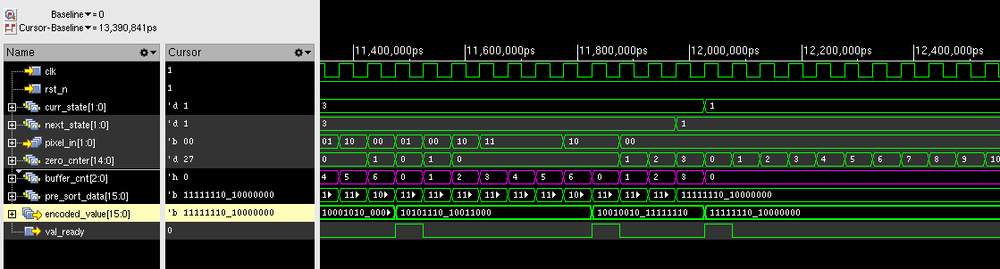

But there just might be some small issues with this implementation I can think of:

+ There is no input control, the module will take a non-stop stream
+ The module cannot stop because there is no stop signal


Now the module is ready to be sent to synthesis and place and route.


## 21 Feb

Today I shall synthesis the design and try a simple implementation to get a rough idea how big this is going to be.


The synthesis showed that 162 cells are needed for this implementation, which takes up a total area of 7540.759 um2.

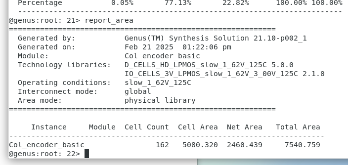


## 24 Feb

Now I will proceed the implementation in innovus for this very basic column based encoder.

After the layout design, the dimension now is 39.760 X 189.840 = 7,548.0384 um2, which is about the results from synthesis.

I have now just saved another version of the layout with saved power rail space on top and bottom.

now the area is 39.2 X 215.110

Ok, I have now just finished the layout of this encoder, which is surprisingly easy and smooth, no hiccup, no DRC needs fixing, no process antenna needs fixing.

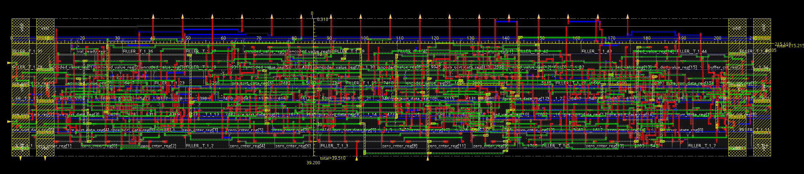


## 25 Feb

After trying out the implementation, I feel that there are too many output ports to be left on the right side.

I can probably add some extra logic to make it squeeze into 8 signals, so that the whole design can have a proper geometry so that the modules can be fit side by side.

In the meantime, I will need to draft up the digital design for 3-bit column based encoder.

There is a simple finite state machine diagram drawn, this should be easy to implement.

## 26 Feb

Now I should be able to implement the 3-bit column based encoder

Also I am planning on doing the test using cocotb, which offers the flexibility of python.

So far, the working RTL simulators are icarus, verilator, model sim does not seem to work after all.


## 27 Feb

So far, there is on thing that I have not sort out in terms of the logic.

This case would happen during SORT. That is when the module needs to report timestamp at a certain point, it needs to clean up and output the current data. This would output the packet as '0_000_000_dat1_dat2_dat3' or '0_000_dat1_dat2_dat3_dat4', these 2 would be indistinguishable because we do not know how many data values have been stored.

During the implementation, I realised that the module has states that cannot deal with incoming data. I am not sure what the interface of the pixel is going to be, but this compression module should have a **busy** signal that marks that the module cannot deal with pixel values at the moment.


Finally finished the implementation, now I need to do the testing.

Roughly looking, the simulation looks okay, the counting and state switching seems correct. 

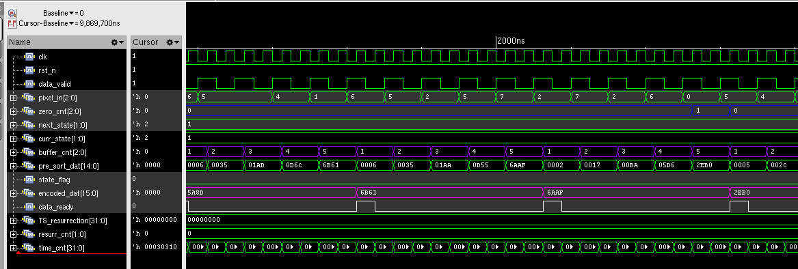

The swtiching between accumulating and zero is also correct:

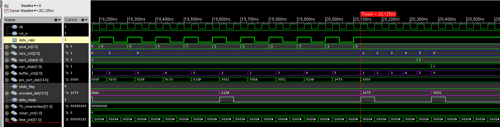

When the state machine transitions from zero back to SORT, it will go through this ressurection state, where 3 16-bit data packets were expected to report the detailed timestamp.

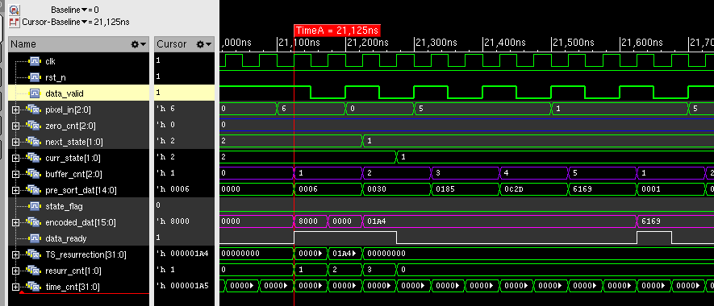

But I have not tested the running alarm, which should be tested now.
This requires the simulation have run  2^16 cycles.

Alarm went off during SORT state where pre-sorted data were output before the timestamp was reported

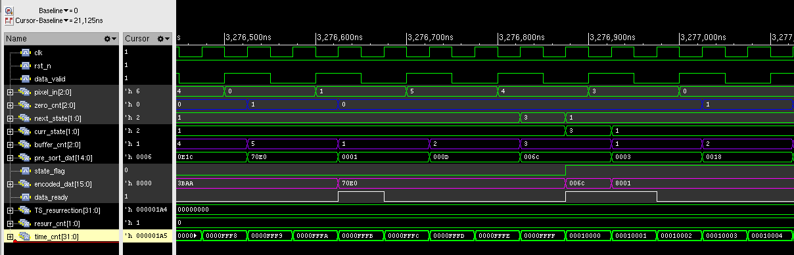

Alarm went off during Zero state, and it correctly returned back to ZERO after a brief SORT state

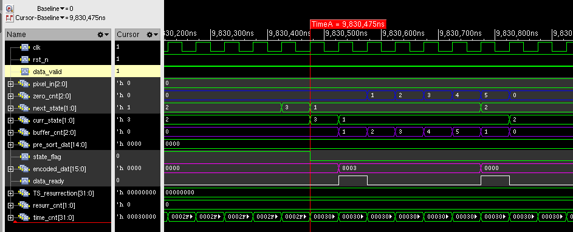

So far the behaviour looks correct, but I have not tested any extreme cases.

Overall, this encoder is able to handle timestamp report, ditching 0s and keep all the rest and switch between states. But from my impression, this is more complicated than the one I have drafted.


## 28 Feb

Since I have finished the implementation, now I want to throw the design into sythesis and get a rough estimation of area.

Since there are a lot of documents needed during synthesis and place and route, and most of them are fairly manual and repetitive, I am thinking of writing a script to generate these documents depending on the flow and technology node.

So after the synthesis, I think genus reported the area of this deisgn is 13,830.332 um2 in total.

Which is a lot bigger compared to my previous design, which is 39.760 X 189.840 = 7,548.0384 um2

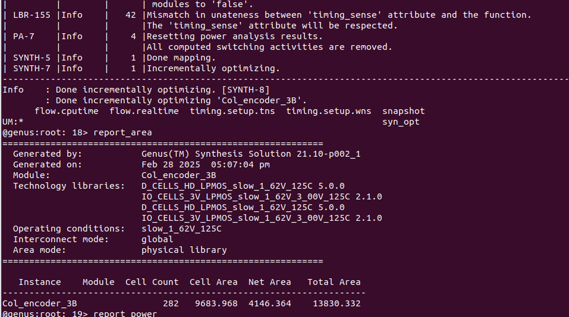

In the meantime, genus reported the power as follow:

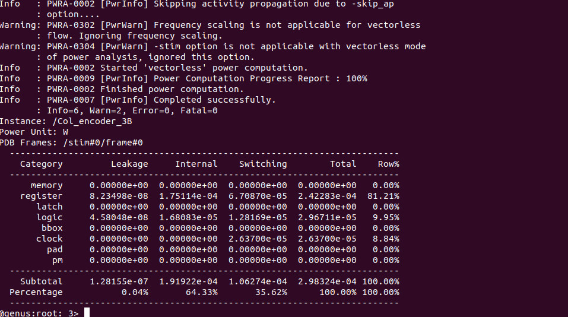


Also, I made a script that can generate a general constraint file, a setup tcl file and a simple flow tcl file.

Simply change into the directory of your project and type 

```bash
Gen_doc_syn -f <module_name> [additional_verilog_file_name]
```

also, there are other options

```bash
Options:
  -t, --tech         Specify the technology node (default: xh018_xx31)
                     All available options xh018(_HD)_xx31, xh018(_HD)_xx33, xh018(_HD)_xx41, xh018(_HD)_xx43
                     xh018(_HD)_xx51
  -o  --output       Specify the output directory (default: current directory)  
  -f, --file        *Specify the design module file name to export corresponding files. (required)
                     (example: ./syn/<module>_constraint.sdc, ./tcl/<module>_setup.tcl, ./syn/<module>_genus.cmd)
  -d, --dft          Specify if dft flow is needed
  -c, --clock        Specify the clock period (unit ns)
  -h, --help         Display this help message
  args...            Additional arguments passed to Synthesis (other verilog files)

```

This script has not been comprehensively tested, and it is only for my own use.


## 3 Mar

I have now finished synthesis, just have to implement another script that may help MMMC file generation.

I shall have another script drafted and tested.

This script will be called **Gen_doc_pnr**.

Also the useful command:

**get_common_ui_ma** 

can translate the clssic command to the stylus common ui command.

This should help a lot about the automation process.

Okay, I think the script that generates a genral mmmc file and load up the design into innovus has succeeded.

The script shall expect the following:

```bash
Options:
  -t, --tech         Specify the technology node (default: xh018_xx31)
                     All available options xh018(_HD)_xx31, xh018(_HD)_xx33, xh018(_HD)_xx41, xh018(_HD)_xx43
                     xh018(_HD)_xx51
  -o, --output       Specify the output directory (default: output_docs)
  -v, --verilog     *Specify the module name (required)
  -h, --help         Display this help message
  args...            Additional arguments passed to the synthesis command
```


The floorplan so far has been given as 40.260 X 350.28 = 14,102.2728 um2

This has yet been properly placed yet.


## 4 Mar

Now I shall keep finishing the implementation.

Ok, it seems that after detailed roting, the layout is suffering from incredible routing congestion.

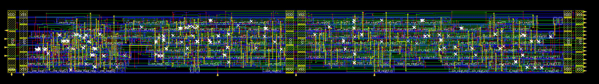


This is a failed design, and also proves that the data line cannot be placed on the tight right handside.

On the contrary, last design successfully survived tense routing.


## 5 Mar

Now I found another useful command for mapping ccopt command to stylus common ui:

**get_ccopt_property_coomon_ui_map**

in the classic ui, it will look like this:

```tcl
set_ccopt_property inverter_cells CKINV* 
```

the corresponding stylus common ui command will look like this:

```tcl
set_db cts_inverter_cells {CKINV*}
``` 

Think I should also start translating the legacy UI tcl files provided by Europractice to Stylus common UI


